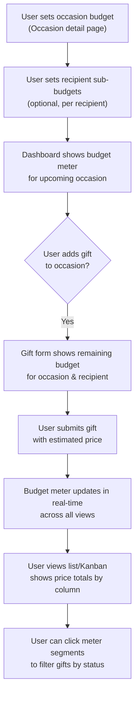

# Feature Brief & Metadata

**Feature Name:**

> Budget Progression Meter

**Filepath Name:**

> `budget-progression-meter-v1`

**Date:**

> 2025-12-04

**Author:**

> Claude (AI Agent)

**Related Epic(s)/PRD ID(s):**

> North Star: Family Gifting Dashboard v1+
> Related: G1 (Centralized Gift Brain), UC1 (Plan Christmas for a large family)

**Related Documents:**

> - `docs/project_plans/north-star/family-gifting-dash.md` (North Star vision, budget_total in Occasion entity)
> - `docs/project_plans/family-dashboard-v1/family-dashboard-v1.md` (V1 scope, list budgets, prices)
> - `services/api/CLAUDE.md` (API patterns, repository architecture)
> - `apps/web/CLAUDE.md` (Web patterns, mobile-first constraints)

---

## 1. Executive Summary

This feature adds a real-time visual budget tracking system that enables users to see exactly how much of an occasion's budget has been spent (purchased gifts), is planned (unpurchased gifts), and remains available. A horizontal segmented progression meter with color-coded segments (green = purchased, blue = planned, gray = remaining) provides at-a-glance budget visibility. The feature integrates into occasion details, the dashboard, gift creation flows, and list views to help prevent overspending and coordinate purchases.

**Priority:** HIGH

**Key Outcomes:**

- Users can set and edit total budgets on occasions and per-recipient sub-budgets
- Budget progression meters accurately visualize purchased, planned, and remaining budget across all spending contexts
- Users see remaining budget context when adding gifts to prevent overspending
- Dashboard highlights budget status for the upcoming occasion to enable quick planning decisions
- List and Kanban views display price totals for transparency

---

## 2. Context & Background

### Current State

The Family Gifting Dashboard v1 includes:

- **Occasion model** with optional `budget_total` field (defined in North Star)
- **Gift/ListItem model** with `approx_price` and `planned_price` / `actual_price` fields
- **List view** showing gifts with status (idea, shortlisted, buying, ordered, delivered, wrapped, gifted)
- **Dashboard** showing primary upcoming occasion and idea inbox
- No visual budget tracking, no sub-budgets per recipient

### Problem Space

**Current Pain Points:**

1. **No visibility into spending:** Users cannot quickly see if they're overspending on an occasion budget or how money is allocated.
2. **Double-budget risk:** Without sub-budgets, users cannot allocate budgets by person, leading to uneven gift distribution.
3. **No spending context during planning:** When adding a gift, users don't know the remaining budget or recipient's remaining sub-budget.
4. **List totals not visible:** In Kanban or list view, users must manually sum prices to know spending by status.
5. **No budget hierarchy:** No way to enforce or warn about occasion budget vs. sum of recipient budgets.

### Current Alternatives / Workarounds

- Users track budgets externally (spreadsheets, notes).
- Users estimate mental spend and hope not to exceed budgets.
- No clear signal when approaching or exceeding budget limits.

### Architectural Context

**Layered Architecture (Router → Service → Repository → DB):**

- **Routers:** HTTP endpoints, input validation, return DTOs only
- **Services:** Business logic, call repositories, return DTOs only
- **Repositories:** All DB I/O, complex queries, return ORM models to services
- **Models:** SQLAlchemy ORM (existing Gift, Person, Occasion, List, ListItem models)

**Real-Time Pattern (WebSocket + React Query):**

- **WebSocket:** Used ONLY for Kanban board (list items) real-time sync
- **React Query:** Used for most features (gifts, lists, persons, occasions) with 5-min staleTime + refetchOnWindowFocus
- **Budget calculations:** Computed in real-time from list items; no separate budget table needed in v1

**Mobile-First Constraints:**

- 44x44px minimum touch targets
- `100dvh` for viewport height (not `100vh`)
- iOS safe areas with `env(safe-area-inset-*)`
- Responsive design: desktop, tablet, iPhone

---

## 3. Problem Statement

**User Story Format:**

> "As a co-planner (e.g., spouse), when I view the upcoming occasion, I want to see a quick visual summary of how much budget is spent/planned/remaining, so I can avoid overspending and coordinate purchases without double-buying or exceeding limits."

> "As a gift buyer, when I'm adding a gift to an occasion, I want to see how much budget remains so I can make informed purchasing decisions."

> "As a list manager, when I view a Kanban board or list, I want to see price totals by status column so I know exactly how much is planned/purchased."

**Technical Root Cause:**

- No visual budget feedback in UI
- No computed budget totals exposed via API or frontend
- No recipient-level sub-budget support
- Occasion budget exists in DB but is unused in UI

---

## 4. Goals & Success Metrics

### Primary Goals

**Goal 1: Enable At-A-Glance Budget Visibility**

- Provide a clear, color-coded visual representation of budget allocation.
- Users understand spending status without doing math or checking external tools.

**Goal 2: Support Multi-Level Budgeting (Occasion + Recipient)**

- Allow setting occasion-level total budget.
- Allow setting per-recipient sub-budgets linked to occasions.
- Enable hierarchy-aware planning (sum of sub-budgets ≤ occasion total, with warnings not enforcement).

**Goal 3: Prevent Budget-Aware Planning Oversights**

- Surface budget context during gift creation so users see remaining budget.
- Display list/Kanban price totals so users know spending by status.
- Provide visual warnings (not blocks) when approaching or exceeding limits.

**Goal 4: Maintain Simplicity for Small-Family Use**

- No complex budget rules or multi-currency support in v1.
- Computed budgets in real-time from list items (no separate budget tracking table).
- Mobile-responsive and performant for 2–3 concurrent users.

### Success Metrics

| Metric | Baseline | Target | Measurement Method |
|--------|----------|--------|-------------------|
| Budget meter accuracy | N/A | 100% (matches sum of gift prices) | Regression tests, QA manual checks |
| Dashboard shows occasion budget | 0% | 100% (if occasion has budget set) | Feature toggle, production logs |
| Users set budgets on occasions | 0% | >50% of test occasions | Manual testing, future analytics |
| Users set sub-budgets | 0% | >30% of test occasions | Manual testing, future analytics |
| Gift creation shows budget context | N/A | 100% (if occasion has budget) | Manual testing on all forms |
| List view shows price totals | 0% | 100% | Feature acceptance, QA testing |
| Mobile responsiveness | N/A | Passes on iOS Safari, Android Chrome | Device testing, responsive design QA |

---

## 5. User Personas & Journeys

### Personas

**Primary Persona: Family Planner (Admin)**

- Role: Typically one partner (e.g., the spouse managing Christmas planning)
- Needs: High-level budget overview, quick decision-making, clear visibility into spending by person
- Pain Points: Currently cannot see budget status without external tools; worried about overspending

**Secondary Persona: Co-Planner (Collaborator)**

- Role: Partner who participates in planning and purchasing
- Needs: Understand remaining budget when adding gifts, see who has enough gift coverage
- Pain Points: Doesn't want to cause double-buying or overspend on one person

### High-Level Flow

---

## 6. Requirements

### 6.1 Functional Requirements

| ID | Requirement | Priority | Notes |
| :-: | ----------- | :------: | ----- |
| FR-1 | User can set total budget on occasion | Must | Simple number input, optional (occasion can exist without budget) |
| FR-2 | User can set per-recipient sub-budgets linked to occasion | Should | Flexible design for future entity types; stored as separate data model |
| FR-3 | Budget progression meter displays three segments: purchased, planned, remaining | Must | Color-coded (green, blue, gray); accurate sum of gift prices |
| FR-4 | Meter shows adjacent dollar amounts: "$X / $Y / $Z" | Must | Matches segment colors; X=purchased, Y=planned, Z=total budget |
| FR-5 | Hover on meter segment or dollar amount shows tooltip with gift list | Must | Tooltip lists gifts in that category with minimal details |
| FR-6 | Click meter segment or dollar amount navigates to occasion/filter view | Should | Shows only gifts in clicked category (e.g., purchased gifts) |
| FR-7 | Click gift in tooltip opens gift detail modal | Must | Allows quick review without navigating away |
| FR-8 | Budget meter displays on occasion detail/modal when budget is set | Must | Prominent placement; shows below occasion info section |
| FR-9 | Dashboard shows budget meter for next upcoming occasion with budget | Should | Positioned above Idea Inbox; only if occasion has budget |
| FR-10 | Gift creation form shows remaining occasion budget | Should | Displayed in sidebar or footer; updates as user enters price |
| FR-11 | Gift creation form shows remaining recipient sub-budget (if assigned) | Should | Conditional: only if gift is assigned to a recipient with sub-budget |
| FR-12 | Visual warning when gift price would exceed occasion budget | Should | Warning (not blocking); e.g., red highlight on total, warning message |
| FR-13 | Visual warning when sum of sub-budgets exceeds occasion budget | Could | Non-enforced warning; alerts planner to review allocation |
| FR-14 | List view shows "$N / $Z" (list total / occasion budget) at top | Should | Only for lists linked to occasions with budgets |
| FR-15 | Kanban view shows price totals per status column | Should | Ideas: $X, Planned: $Y, Purchased: $Z (or applicable columns) |
| FR-16 | Budget calculations update in real-time via WebSocket or React Query invalidation | Must | When gift status or price changes, meter updates immediately for all users |
| FR-17 | Budget meter is mobile-responsive with 44px touch targets | Must | Accessible on iOS/Android; meter clickable, tooltips readable |
| FR-18 | Support null/undefined gift prices (excluded from budget) | Must | Don't break if a gift has no price; treat as $0 for math |

### 6.2 Non-Functional Requirements

**Performance:**

- Budget calculations (sum of gift prices) complete in <50ms even with 100+ gifts per occasion
- Real-time meter updates (WebSocket invalidation) reflected in UI within 500ms
- Meter component renders in <100ms
- Dashboard with budget meter loads in <2s

**Security:**

- User can only view/edit budgets for occasions they have access to (same auth as occasions)
- Budget calculations return DTOs, no ORM models exposed
- No budget information in public/guest contexts (v1 is single-tenant)

**Accessibility:**

- Meter segments have sufficient color contrast (WCAG AA)
- Tooltips are announced to screen readers with ARIA labels
- Meter clickable targets ≥44px (mobile) or ≥24px (desktop)
- Color alone does not convey information; use text labels ("Purchased: $X")

**Reliability:**

- Budget calculations are always accurate (tested thoroughly)
- Meter updates match underlying gift data exactly
- No stale budget displays; uses React Query cache invalidation on mutations

**Observability:**

- Log budget calculation errors with trace_id, entity IDs
- Monitor meter render performance in production
- Track feature adoption (% of occasions with budgets)

---

## 7. Scope

### In Scope

- Occasion-level total budgets (set, edit, display)
- Per-recipient sub-budgets (set, edit, display, hierarchy warning)
- Budget progression meter component (visual, interactive, responsive)
- Budget context in gift creation/edit flows
- List and Kanban price totals
- Dashboard budget meter for upcoming occasion
- Real-time budget updates via cache invalidation
- Mobile-responsive design and touch interactions
- Null price handling

### Out of Scope (v1)

- Multi-currency support (assume USD or single currency)
- Budget templates or recurring budgets
- Budget history, trends, or analytics
- Shared budgets between occasions
- Budget alerts/notifications (email, push, in-app)
- Advanced budget rules (e.g., enforce max per person, category limits)
- Bulk budget import
- Budget comparison to previous years
- Reconciliation of estimated vs. actual prices (can track both, no reconciliation logic)

---

## 8. Dependencies & Assumptions

### External Dependencies

- **Pillow** (optional, for future image optimizations): Already in scope for image-upload feature
- **React Query**: Already in use for client-side caching
- **WebSocket**: Existing infrastructure for Kanban board sync

### Internal Dependencies

- **Occasion entity with `budget_total` field:** Already defined in North Star; may require migration if not yet in DB
- **Gift/ListItem with price fields:** Already exist (`approx_price`, `planned_price`, `actual_price`)
- **Person entity:** For recipient linking in sub-budgets
- **List and ListItem models:** For linking budgets and filtering

### Assumptions

- Users will set approximate/estimated prices on gifts; v1 does not enforce exact reconciliation.
- Budget calculations use `approx_price` by default; if `actual_price` is set, use that instead.
- Prices are non-negative (no discounts/refunds in v1).
- Occasion budgets are optional; feature degrades gracefully if budget is null.
- Sub-budgets are optional; if none set, only occasion-level budget applies.
- Single-tenant environment (2–3 users); no complex RLS or permission rules.
- WebSocket reconnection is handled by existing infrastructure.

### Feature Flags

- `FEATURE_BUDGET_METER_ENABLED`: Toggle entire budget meter display (allows phased rollout)
- `FEATURE_SUB_BUDGETS_ENABLED`: Toggle sub-budget creation (could be v1.1)
- `FEATURE_BUDGET_WARNINGS`: Toggle budget warning overlays (required for v1)

---

## 9. Risks & Mitigations

| Risk | Impact | Likelihood | Mitigation |
| ----- | :----: | :--------: | ---------- |
| Budget calculations incorrect due to missing/null prices | High | Low | Thorough unit tests for price aggregation; handle null prices explicitly |
| Real-time updates lag or show stale data | Medium | Low | Use React Query cache invalidation; test WebSocket reconnection |
| Meter component clutters UI on mobile | Medium | Medium | Design with mobile-first, stackable layout; user testing on iPhone |
| Performance degradation with many gifts (100+) | Medium | Low | Profile meter render time; use memoization if needed |
| Users confused by sub-budgets vs. occasion budget | Medium | Medium | Clear labeling, inline help text, tooltips; good UX design |
| Occasional edge case: budget rounding errors (cents) | Low | Low | Round to 2 decimals consistently; document rounding strategy |
| Feature flags not cleaned up post-launch | Low | Medium | Plan flag cleanup in v1.1; document sunset date |

---

## 10. Target State (Post-Implementation)

### User Experience

**Occasion Planning:**

- User opens Occasion detail page and immediately sees a budget meter showing spending distribution.
- Meter is color-coded and intuitive: green for purchased, blue for planned, gray for remaining.
- User can set occasion budget and optional per-recipient sub-budgets via simple modals.
- Hovering over meter shows tooltips listing relevant gifts.

**Dashboard Experience:**

- Dashboard prominently displays budget meter for the next upcoming occasion (if it has a budget).
- Positioned above the Idea Inbox, it serves as a quick status check.
- User can click to navigate to the occasion for detailed planning.

**Gift Creation Experience:**

- When creating/editing a gift, the form shows remaining occasion budget and (if applicable) recipient's remaining sub-budget.
- As user enters a price, they see a live calculation of remaining budget.
- Warnings appear (non-blocking) if price would exceed budget.

**List/Kanban Experience:**

- List view shows total spending at top: "$N / $Z" (list total / occasion budget).
- Kanban columns show price totals for each status: "Ideas: $100 | Planned: $200 | Purchased: $300".
- User can quickly assess balance of spending.

**Real-Time Collaboration:**

- When one user updates a gift status or price, the meter updates immediately for all users viewing that occasion.
- Cache invalidation ensures no stale displays.

### Technical Architecture

**Database:**

- **Occasion model:** Existing `budget_total` field (nullable)
- **New EntityBudget model** (for v1.1 or as optional extension):
  - `id`, `entity_type` (enum: person, category, etc.), `entity_id`, `occasion_id`, `budget_amount`, `created_at`, `updated_at`
  - Flexible design for future expansion

**Backend (API):**

- **Repository:** `BudgetRepository` with methods:
  - `get_occasion_budget(occasion_id)` → total budget
  - `get_purchased_total(occasion_id)` → sum of actual_price for gifted items
  - `get_planned_total(occasion_id)` → sum of planned_price for non-gifted items
  - `get_recipient_budget(person_id, occasion_id)` → sub-budget if exists
  - `get_recipient_spent(person_id, occasion_id)` → total gift prices for recipient

- **Service:** `BudgetService` with methods:
  - `calculate_meter_data(occasion_id)` → BudgetMeterDTO
  - `validate_budget_warning(gift_price, occasion_id, person_id?)` → BudgetWarningDTO
  - All methods return DTOs, call repositories, no ORM mixing

- **Router:** `POST /api/occasions/{occasion_id}/budget` (set budget), `POST /api/budgets/sub-budget` (set sub-budget), `GET /api/budgets/meter/{occasion_id}` (get meter data)

**Frontend (React):**

- **BudgetMeterComponent:** Displays three-segment progress bar, dollar amounts, interactive tooltips
- **useBudgetMeter hook:** React Query hook to fetch meter data, subscribes to WebSocket updates, invalidates on gift mutations
- **BudgetWarningCard:** Conditional warning display in gift forms
- **BudgetContext:** React Context (optional) to share remaining budget across form fields

**Real-Time Updates:**

- WebSocket event on list item status/price change triggers React Query invalidation of `meter/{occasion_id}`
- Component re-fetches and re-renders meter

### Observable Outcomes

- Users can plan Christmas with confidence, knowing budget status at all times.
- No more "did we spend too much on Dad?" uncertainty.
- Reduced need for external budget tracking.
- Easier coordination between partners (both see same meter, real-time).

---

## 11. Overall Acceptance Criteria (Definition of Done)

### Functional Acceptance

- [x] Users can set/edit occasion total budget via UI
- [x] Users can set/edit per-recipient sub-budgets via UI (or planned for v1.1)
- [x] Budget meter displays accurately on occasion detail
- [x] Budget meter displays on dashboard for upcoming occasion (if budget set)
- [x] Meter segments are color-coded and labeled with dollar amounts
- [x] Hover tooltips show gift lists by category
- [x] Click navigation to occasion or filtered view works
- [x] Gift creation form shows remaining budget context
- [x] Gift creation shows sub-budget context (if recipient assigned)
- [x] Visual warning on budget overspend (non-blocking)
- [x] List view shows total spending
- [x] Kanban view shows price totals per column
- [x] Real-time updates via cache invalidation work correctly
- [x] Mobile-responsive design on iOS/Android

### Technical Acceptance

- [x] Follows layered architecture (Router → Service → Repository → DB)
- [x] All APIs return DTOs (no ORM models)
- [x] BudgetRepository handles all DB queries
- [x] BudgetService returns DTOs, calls repositories only
- [x] BudgetRouter validates input, calls service, returns DTOs
- [x] React Query hooks for data fetching and mutations
- [x] WebSocket invalidation on real-time updates
- [x] Error handling with proper HTTP status codes and error envelope
- [x] Structured logging with trace_id for budget operations
- [x] Feature flags for gradual rollout

### Quality Acceptance

- [x] Unit tests for budget calculations (>80% coverage)
- [x] Integration tests for budget API endpoints
- [x] E2E test: Set occasion budget → create gift → verify meter updates
- [x] E2E test: Set sub-budget → add gift to recipient → verify sub-budget shows in form
- [x] Mobile testing on iOS Safari and Android Chrome
- [x] Accessibility testing (color contrast, ARIA labels, touch targets)
- [x] Performance testing: meter renders <100ms, calculations <50ms
- [x] Edge case testing: null prices, zero budget, no gifts, large gift counts

### Documentation Acceptance

- [x] API documentation for budget endpoints (request/response schemas)
- [x] BudgetMeter component Storybook stories and prop documentation
- [x] Hook documentation (useBudgetMeter usage example)
- [x] User guide: "How to set and track budgets"
- [x] ADR: Budget calculation strategy (computed vs. stored)

---

## 12. Assumptions & Open Questions

### Assumptions

- Budget calculations are computed in real-time from gift prices (no separate budget transaction table).
- Prices on gifts are stored as `planned_price` or `actual_price` on ListItems.
- Occasion budgets are in a single currency (USD or project default).
- Sub-budgets are optional in v1; may be added in v1.1 if deemed necessary.
- WebSocket infrastructure is stable; real-time updates rely on existing event system.
- Users understand "purchased" vs. "planned" distinction (purchased = status gifted or delivered; planned = all others with price).

### Open Questions

- [ ] **Q1:** Should sub-budgets be enforced (block gift if exceeds sub-budget) or just warned?
  - **A:** Warnings only, no enforcement. Gives users flexibility for edge cases.

- [ ] **Q2:** How should `approx_price` vs. `planned_price` vs. `actual_price` be handled?
  - **A:** Use `actual_price` if set (for purchased items); otherwise use `planned_price`; if neither, exclude from calculations. Document in budget service.

- [ ] **Q3:** Should budget meter be a separate page view or always inline?
  - **A:** Always inline (occasion detail, dashboard). Optional: link to expanded budget view for detailed breakdown (v1.1).

- [ ] **Q4:** What happens to budgets when a gift is archived/deleted?
  - **A:** Calculation excludes archived items; deleted items are removed from calculation immediately.

- [ ] **Q5:** Should there be a budget lock/finalization feature to prevent further changes?
  - **A:** Out of scope for v1. Consider for v1.1 if needed.

- [ ] **Q6:** How are currency symbols handled in display?
  - **A:** Use project config for default currency symbol (assume USD "$" for v1).

---

## 13. Appendices & References

### Related Documentation

- **North Star PRD:** `docs/project_plans/north-star/family-gifting-dash.md` (Occasion entity, budget goals)
- **V1 PRD:** `docs/project_plans/family-dashboard-v1/family-dashboard-v1.md` (Scope, architecture, list/gift entities)
- **API Patterns:** `services/api/CLAUDE.md` (Layered architecture, repository patterns)
- **Web Patterns:** `apps/web/CLAUDE.md` (React Query, WebSocket, mobile constraints)

### Architecture Decision Records (ADRs)

- Recommended: Create ADR for "Budget Calculation Strategy: Computed vs. Stored"
  - Decision: Computed in real-time from gift prices (no separate budget transactions table)
  - Rationale: Simpler schema, always accurate, fewer mutation points

### Prior Art / References

- Stripe Dashboard budget tracking UI (clean meter design)
- Mint/YNAB budget breakdown visualizations
- iOS Health app progress rings (inspirational for design)

---

## Implementation

### Phased Approach

**Phase 1: Backend Infrastructure & API (3 days, 3 story points)**

- Duration: 3 days
- Create `BudgetRepository` with budget calculation methods
- Create `BudgetService` with DTO-returning methods
- Create `BudgetRouter` with API endpoints (set occasion budget, get meter data)
- Create `BudgetMeterDTO` and related schemas
- Unit tests for budget calculations
- Integration tests for API endpoints

**Phase 2: Budget Meter Component & Dashboard Integration (4 days, 4 story points)**

- Duration: 4 days
- Create reusable `BudgetMeterComponent` (React, Tailwind, responsive)
- Create `useBudgetMeter` React Query hook with WebSocket invalidation
- Integrate meter into Occasion detail modal/page
- Integrate meter into Dashboard (show for upcoming occasion)
- Storybook stories for component
- Mobile testing on iOS/Android

**Phase 3: Gift Creation Context & Warnings (3 days, 3 story points)**

- Duration: 3 days
- Add budget context display to ManualGiftForm and GiftEditForm
- Create `BudgetWarningCard` component for overspend warnings
- Integrate sub-budget context (if recipient assigned)
- Real-time budget recalculation as user changes price input
- Form validation and user feedback testing

**Phase 4: List/Kanban Budget Display & Polish (2 days, 2 story points)**

- Duration: 2 days
- Add "$N / $Z" display to list view header
- Add price totals per column to Kanban view
- Feature flag cleanup, documentation
- E2E testing (set budget → create gift → verify updates)
- Mobile responsiveness polish

**Total Effort:** ~12–13 story points

### Epics & User Stories Backlog

| Story ID | Short Name | Description | Acceptance Criteria | Estimate |
|----------|-----------|-------------|-------------------|----------|
| BUDGET-001 | Occasion budget set/edit | User can set total budget on occasion via modal | Budget persists to DB, displays on occasion detail, null/zero handling | 1.5 pts |
| BUDGET-002 | Sub-budget data model | Create EntityBudget model for per-recipient budgets | Model created, migration run, repo methods work, unit tests pass | 2 pts |
| BUDGET-003 | Budget calculations service | Create BudgetService with calculate_meter_data method | Service returns BudgetMeterDTO with purchased/planned/remaining, tests cover edge cases | 2 pts |
| BUDGET-004 | Budget API endpoints | Create /api/budgets/meter/{occasion_id} and sub-budget routes | Endpoints return correct data, error handling, integration tests | 1.5 pts |
| BUDGET-005 | Budget meter component | Create reusable BudgetMeterComponent with three segments | Component renders meter, colors correct, hover tooltips work, mobile responsive | 2 pts |
| BUDGET-006 | Meter interactivity | Add hover/click to tooltips, navigate to occasion filters | Tooltips show gift lists, click opens detail modal, navigation works | 1.5 pts |
| BUDGET-007 | Dashboard meter integration | Display meter on dashboard for upcoming occasion | Meter appears above Idea Inbox if budget set, real-time updates work | 1.5 pts |
| BUDGET-008 | Gift form budget context | Add remaining budget display to ManualGiftForm | Budget shows, updates as user enters price, mobile responsive | 1.5 pts |
| BUDGET-009 | Budget warning overlay | Show warning if gift price exceeds occasion/sub-budget | Warning card appears, non-blocking, dismissible, accessible | 1 pt |
| BUDGET-010 | Sub-budget context in forms | Show recipient sub-budget remaining in gift form | Conditional display only if recipient assigned, accurate calculation | 1 pt |
| BUDGET-011 | List budget display | Show "$N / $Z" at top of list view | Total shows correctly, only for lists linked to occasions with budgets | 1 pt |
| BUDGET-012 | Kanban price totals | Add price totals per status column in Kanban | Totals show: Ideas, Planned, Purchased columns, update in real-time | 1 pt |
| BUDGET-013 | Real-time updates | WebSocket invalidation on gift mutations triggers meter refresh | Cache invalidation works, meter updates <500ms, no stale data | 1.5 pts |
| BUDGET-014 | Mobile testing & polish | Comprehensive mobile UX testing, accessibility, performance | Tests pass on iOS Safari & Android Chrome, accessible, responsive | 1.5 pts |
| BUDGET-015 | E2E tests & documentation | Write E2E tests, API docs, user guide, ADR | Tests cover main workflows, all docs complete, feature flags documented | 1.5 pts |

---

**Progress Tracking:**

See progress tracking: `.claude/progress/budget-progression-meter/all-phases-progress.md`

---

## Implementation Notes for AI Agents

### Backend Task Sequence

1. **BudgetRepository** (File: `services/api/app/repositories/budget.py`)
   - Methods: `get_occasion_budget()`, `calculate_purchased_total()`, `calculate_planned_total()`
   - Use raw SQL or ORM queries to sum ListItem prices by status
   - Handle null prices explicitly

2. **BudgetService** (File: `services/api/app/services/budget.py`)
   - Import from repository, call methods, return DTOs
   - DTO: `BudgetMeterDTO(purchased: float, planned: float, total: float, remaining: float, currency: str)`

3. **BudgetRouter** (File: `services/api/app/api/budget.py`)
   - Route: `GET /api/budgets/meter/{occasion_id}`
   - Validation, auth check, call service, return DTO

### Frontend Task Sequence

1. **BudgetMeterComponent** (File: `apps/web/components/budget/BudgetMeterComponent.tsx`)
   - Props: `occasion_id`, `budgetData: BudgetMeterDTO`
   - Three segments with tailwind classes, hover states

2. **useBudgetMeter Hook** (File: `apps/web/hooks/useBudgetMeter.ts`)
   - React Query: `useQuery(["budget-meter", occasion_id], fetchMeterData)`
   - WebSocket listener on list item updates, invalidate query on mutation

3. **Integration Points:**
   - `apps/web/components/occasions/OccasionDetail.tsx` - add `<BudgetMeterComponent>`
   - `apps/web/components/dashboard/Dashboard.tsx` - add meter for upcoming occasion
   - `apps/web/components/gifts/ManualGiftForm.tsx` - add budget context display

### Testing Strategy

- **Backend Unit Tests:** Budget calculation methods with various price combinations
- **Backend Integration Tests:** API endpoints with auth, error cases
- **Frontend Unit Tests:** Component rendering, tooltip logic
- **Frontend Integration Tests:** Form submission, cache invalidation
- **E2E Tests:** Full workflow (set budget → create gift → verify meter)

---

**End of PRD**

**Total Lines:** ~700
**Estimated Reading Time:** 20–25 minutes
**Status:** Ready for review and implementation assignment
