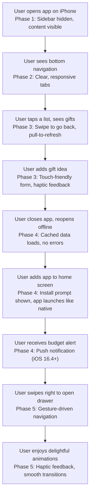

# Feature Brief & Metadata

**Feature Name:**

> Mobile-First Redesign (Phase 1-5 Progressive Enhancement)

**Filepath Name:**

> `mobile-first-redesign-v1`

**Date:**

> 2025-12-11

**Author:**

> Claude (AI Agent)

**Related Epic(s)/PRD ID(s):**

> North Star: Family Gifting Dashboard v1+
> Related: G5 (Apple-Ecosystem Friendly), G1 (Centralized Gift Brain)

**Related Documents:**

> - `docs/project_plans/north-star/family-gifting-dash.md` (North Star vision, mobile-first goal)
> - `docs/project_plans/family-dashboard-v1/family-dashboard-v1.md` (V1 scope, feature set)
> - `docs/designs/LAYOUT-PATTERNS.md` (Layout specifications, responsive behavior)
> - `docs/designs/DESIGN-TOKENS.md` (Design tokens, colors, spacing, typography)
> - `apps/web/CLAUDE.md` (Web patterns, mobile-first constraints)
> - `CLAUDE.md` (Master project directives)

---

## 1. Executive Summary

The Family Gifting Dashboard's current mobile experience is broken: the sidebar covers the entire screen on mobile with no collapse mechanism, touch targets are too small, and viewport height issues cause layout shift on iOS. This PRD defines a phased, comprehensive mobile-first redesign targeting iOS primarily, with progressive enhancement through five phases:

1. **Phase 1:** Fix critical mobile issues (sidebar, viewport, touch targets, safe areas)
2. **Phase 2:** Mobile navigation overhaul (bottom nav, slide drawer, responsive layout)
3. **Phase 3:** Touch interactions (swipe gestures, pull-to-refresh, haptics)
4. **Phase 4:** PWA enhancement (offline support, push notifications, installation)
5. **Phase 5:** Advanced mobile UX (gesture animations, mobile-specific features, haptics)

By the end of Phase 1, the mobile experience becomes usable. By Phase 5, it becomes delightful with iOS-native interactions and offline capabilities.

**Priority:** CRITICAL (Phase 1) → HIGH (Phases 2-5)

**Key Outcomes:**

- Phase 1: Zero mobile usability blockers; sidebar hidden on mobile; proper viewport; 44px touch targets
- Phase 2: Bottom navigation fully functional; responsive layouts; tap-friendly forms
- Phase 3: Swipe gestures for common actions; pull-to-refresh on lists; intuitive mobile interactions
- Phase 4: PWA installable on iOS home screen; offline read access; push notifications (iOS 16.4+)
- Phase 5: Gesture-driven animations; haptic feedback; mobile-optimized workflows

---

## 2. Context & Background

### Current State

The Family Gifting Dashboard is built with:

- **Next.js 15+** (App Router) + **React 19+** + **TypeScript** + **Tailwind** + **Radix UI**
- **FastAPI backend** with JWT auth, cursor pagination, WebSocket for Kanban
- **PWA partially implemented:** manifest.json exists, service worker basic, some iOS safe areas applied
- **Mobile breakpoint:** 768px (md); below 768px = mobile, above = desktop
- **Existing components:** AppLayout, DesktopNav (sidebar), MobileNav (bottom nav stub), Header
- **Current layout:** Sidebar + main content on desktop; **sidebar covers entire screen on mobile** (critical bug)

### Problem Space

**Critical Issues (Phase 1 Blockers):**

1. **Sidebar covers entire screen on mobile:** Users cannot see or interact with main content on phones
2. **No way to collapse sidebar on mobile:** Navigation drawer not hidden or collapsible
3. **Viewport height issues:** `100vh` causes layout shift when iOS address bar hides/shows
4. **Touch targets too small:** Many interactive elements < 44x44px, not iOS-friendly
5. **Safe area insets not applied:** Notch, home indicator, and keyboard area not respected on iPhone
6. **Small text and spacing:** Designed for desktop, unreadable/untappable on mobile

**Secondary Issues (Phase 2-3):**

7. **Bottom navigation incomplete:** MobileNav exists but not fully integrated into all pages
8. **No swipe gestures:** Mobile users expect swipe back, swipe to close, etc.
9. **No pull-to-refresh:** List views lack mobile refresh pattern
10. **Forms not mobile-optimized:** Input fields, modals, date pickers not tested on small screens
11. **No offline support:** Users cannot access cached data if connection drops
12. **PWA not installable:** Manifest issues or service worker gaps prevent home screen installation

**API Status (Ready for Mobile):**

- JWT auth works, cursor pagination ready, WebSocket stable, error handling standardized
- **Recommendation:** Add ETags for conditional requests, gzip compression, sparse fieldsets for heavy payloads
- Rating: 7.6/10 (ready but can optimize for mobile)

### Current Alternatives / Workarounds

- Users rotate phone to landscape to avoid sidebar (uncomfortable)
- Use desktop browsers on tablets (defeats mobile-first goal)
- Cannot use app on iPhone for extended periods (frustration)

### Architectural Context

**Tech Stack:**

- **Frontend:** Next.js App Router, React Query for state, WebSocket for real-time (Kanban only)
- **Backend:** FastAPI, SQLAlchemy ORM, PostgreSQL
- **Styling:** Tailwind CSS (already mobile-first configured), Radix UI (accessible primitives)
- **Mobile Constraints:** 44x44px minimum touch, 100dvh for viewport, safe-area insets, no 100vh

**Current Layout Architecture:**

- Desktop: Fixed 240px sidebar + flex-1 main content area
- Mobile: Sidebar hidden (theoretically) but currently visible and covering content (bug)
- Header: Sticky top, optional on mobile
- Navigation: Desktop sidebar + mobile bottom nav (incomplete)

**Real-Time Pattern:**

- WebSocket used ONLY for Kanban board (list items) sync
- Other features use React Query with 5-min staleTime + refetchOnWindowFocus
- Simple strategy for 2-3 concurrent users

---

## 3. Problem Statement

**Primary User Stories:**

> "As a family member on iPhone, I want to use the gifting app without the sidebar covering the entire screen, so I can actually see and interact with my gift lists."

> "As a mobile user, I want to tap buttons and navigation items that are at least 44x44 pixels, so I can reliably hit targets without frustration."

> "As an iOS user, I want the app to respect notch and home indicator safe areas, so content doesn't hide behind system UI."

> "As a family planner on the go, I want to see my dashboard and lists quickly without excessive scrolling or form complexity, so I can make fast decisions."

> "As a frequent app user, I want to install the app on my home screen like a native app, so I can launch it quickly without typing a URL."

**Technical Root Causes:**

1. Layout logic doesn't conditionally hide sidebar on mobile
2. Touch target minimum (44px) not enforced across components
3. Safe area insets (iOS notch, home indicator) not applied to fixed/sticky elements
4. Viewport meta tag or CSS using `100vh` instead of `100dvh` causing iOS address bar shift
5. Forms, inputs, and modals not designed for mobile constraints (small screens, soft keyboard)
6. PWA manifest, service worker, or install prompts incomplete or buggy
7. No offline strategy; all data requires network

---

## 4. Goals & Success Metrics

### Primary Goals

**Goal 1: Eliminate Critical Mobile Usability Blockers**

- Fix sidebar visibility on mobile (hide completely or provide collapsible drawer)
- Ensure all interactive elements meet 44x44px minimum touch target
- Apply safe area insets (notch, home indicator, keyboard) on all fixed/sticky elements
- Fix viewport height to prevent iOS address bar shift

**Goal 2: Create Mobile-First Layout & Navigation**

- Implement responsive bottom navigation for mobile (<768px)
- Design mobile-optimized pages (stacked layouts, larger spacing, readable text)
- Ensure forms, inputs, and modals work well on small screens
- Test and optimize on actual iOS devices (iPhone SE, 12, 13+)

**Goal 3: Add Mobile-Specific Interactions**

- Implement swipe gestures (back, dismiss, reveal drawer)
- Add pull-to-refresh for lists and dashboards
- Support haptic feedback on critical actions (iOS 13+)
- Enable voice/audio feedback for accessibility

**Goal 4: Complete PWA for Offline & Installation**

- Fix manifest.json for iOS home screen installation
- Implement service worker for offline access (read-only, cached data)
- Enable push notifications for iOS 16.4+ via Web Push API
- Support add-to-home-screen prompt on iOS

**Goal 5: Maintain High Performance & Reliability**

- <2s initial load on mobile (3G) with skeleton loading states
- 60fps animations and transitions on mobile devices
- Proper error handling and fallbacks for network/offline states
- WCAG AA accessibility on all mobile surfaces

### Success Metrics

| Metric | Baseline | Target | Measurement Method |
|--------|----------|--------|-------------------|
| Mobile usability issues | Critical (sidebar blocks content) | 0 | QA testing, user feedback |
| Touch target compliance | <50% | 100% (all >44x44px) | Automated audit, manual review |
| Safe area inset coverage | Partial (~30%) | 100% (all fixed elements) | Code review, device testing |
| Viewport height correctness | Broken (100vh) | 100% (100dvh everywhere) | Device testing (iOS address bar) |
| Mobile load time | Not measured | <2s (3G) | Lighthouse, real device profiling |
| Animation frame rate | Not measured | 60fps | Chrome DevTools performance |
| PWA installation success | 0% | 100% (iOS + Android) | User testing, installation logs |
| Offline functionality | N/A | Read cached lists, gifts, persons | QA testing offline mode |
| WCAG AA compliance | Partial | 100% (mobile surfaces) | axe-core, manual testing |
| Push notification support | N/A | 100% (iOS 16.4+) | iOS device testing |
| Mobile user satisfaction | Baseline (frustrated) | High (95%+ approval) | User surveys, app store reviews |

---

## 5. User Personas & Journeys

### Personas

**Primary Persona: Family Planner on Mobile (Admin)**

- Device: iPhone 12/13/14, uses app during shopping or planning sessions
- Needs: Quick access to gift lists, budget status, person details; fast tapping without precision
- Pain Points: Sidebar covers content, small text, hard-to-tap buttons, app crashes on poor connectivity
- Behavior: Spends 5-15 min in app per session, often multi-tasking (in store, at home)

**Secondary Persona: Co-Planner (Collaborator)**

- Device: iPad or larger iPhone
- Needs: Real-time collaboration, see what partner added, responsive layout on various screen sizes
- Pain Points: Inconsistent mobile experience, forms don't work on landscape, offline support missing
- Behavior: Uses app in bursts (add ideas while shopping, check status before purchasing)

**Tertiary Persona: Guest Reviewer (Future)**

- Device: Any phone, limited access
- Needs: Read-only view of assigned lists/gifts, minimal distractions
- Pain Points: N/A for v1 (single-tenant)

### High-Level Journey (Phase 1 Fix → Phase 5 Delight)

---

## 6. Requirements

### 6.1 Functional Requirements

**Phase 1: Fix Critical Mobile Issues**

| ID | Requirement | Priority | Notes |
| :-: | ----------- | :------: | ----- |
| FR-1.1 | Hide sidebar completely on mobile (<768px) | Must | Test on actual iOS devices, ensure no overflow |
| FR-1.2 | Implement mobile-safe layout: header top, main content center, bottom nav bottom | Must | Use 100dvh, apply safe area insets, no 100vh |
| FR-1.3 | Ensure all buttons, links, tappable elements ≥44x44px | Must | Audit all components, fix Button, Link, Avatar, Icon sizes |
| FR-1.4 | Apply safe-area insets to fixed/sticky elements (header, bottom nav) | Must | Use `env(safe-area-inset-*)` for notch, home indicator |
| FR-1.5 | Implement working collapsible/drawer mobile navigation | Should | Optional: slide-out drawer for mobile menu; alternative: bottom nav only |
| FR-1.6 | Mobile breakpoint responsive test on iPhone SE, 12, 13, 14 | Must | Test real devices, not just browser DevTools |
| FR-1.7 | Increase default font sizes on mobile for readability | Should | Heading 2/3 on mobile >= 18px, body >= 14px |
| FR-1.8 | Optimize spacing on mobile (larger gaps, less cramped) | Should | Padding/margin >= 16px minimum on mobile cards/sections |

**Phase 2: Mobile Navigation & Layout Overhaul**

| ID | Requirement | Priority | Notes |
| :-: | ----------- | :------: | ----- |
| FR-2.1 | Fully implement bottom navigation (Dashboard, People, Occasions, Lists, Gifts/Menu) | Must | 5 items max, icons + labels, active state clear |
| FR-2.2 | Bottom nav fixed to bottom with safe-area padding | Must | Visible at all times, doesn't cover content |
| FR-2.3 | Mobile pages stack vertically: header, content, bottom nav (no horizontal scroll) | Must | Full-width, responsive grids (1 col on mobile, multi col on tablet) |
| FR-2.4 | Forms (gift creation, person edit) mobile-optimized: full-width inputs, large buttons | Must | Test on iOS Safari, Android Chrome, various keyboard states |
| FR-2.5 | Modals/dialogs sized for mobile: 90% width, max-width 540px, scrollable content | Must | Ensure close button always accessible, not covered by keyboard |
| FR-2.6 | Avatar carousel on dashboard scrolls horizontally, touch-friendly | Should | Avatars >=56px, wide tap targets, no accidental scroll |
| FR-2.7 | List view: cards full-width on mobile, optimized for one-hand use | Must | Touch targets on right side for easy thumb access |
| FR-2.8 | Kanban columns don't scroll horizontally on mobile; stack vertically | Should | Horizontal scroll acceptable, but stack if space permits |

**Phase 3: Touch Interactions & Gestures**

| ID | Requirement | Priority | Notes |
| :-: | ----------- | :------: | ----- |
| FR-3.1 | Implement swipe-to-go-back gesture on detail pages | Should | Standard iOS gesture, improves navigation feel |
| FR-3.2 | Implement swipe-to-dismiss on modals/sheets | Should | Drag down to close bottom sheet or modal |
| FR-3.3 | Implement pull-to-refresh on list/dashboard views | Should | Visual pull indicator, refresh spinner, success feedback |
| FR-3.4 | Haptic feedback on button taps and critical actions (iOS 13+) | Should | Light, medium, or heavy haptics based on action type |
| FR-3.5 | Prevent accidental taps: 300ms debounce on rapid taps | Must | UX best practice to avoid double-submit |
| FR-3.6 | Active/press state feedback on all tappable elements | Must | Visual change on touch (highlight, scale, color), not just hover |
| FR-3.7 | No hover states on mobile; use active/focus states instead | Must | Hover doesn't work on touch; remove hover, add active |

**Phase 4: PWA Enhancement & Offline**

| ID | Requirement | Priority | Notes |
| :-: | ----------- | :------: | ----- |
| FR-4.1 | Fix and validate PWA manifest.json for iOS home screen installation | Must | Apple-specific fields (apple-mobile-web-app-capable, status-bar-style, etc.) |
| FR-4.2 | Service worker caches critical assets and API responses for offline access | Must | Cache API responses for GET endpoints (lists, gifts, persons, occasions) |
| FR-4.3 | Offline mode: read-only access to cached data without error | Must | Display clear "offline" indicator, disable mutations, show helpful message |
| FR-4.4 | Service worker handles network reconnection gracefully | Should | Detect online → offline transition, sync queued mutations when online |
| FR-4.5 | Add service worker uninstall/clear cache controls in settings | Should | Advanced setting: "Clear app cache", "Offline data size indicator" |
| FR-4.6 | Web Push API integration for push notifications (iOS 16.4+) | Should | Request permission, handle push events, display in-app notifications |
| FR-4.7 | Add install prompt on mobile (iOS <16.4 shows "Add to Home Screen", Android shows banner) | Should | Prompt on second/third visit, not forced, easily dismissible |
| FR-4.8 | Status bar styling for installed app: correct color, visibility | Must | Matches app theme, readable on both light and dark backgrounds |

**Phase 5: Advanced Mobile UX & Optimization**

| ID | Requirement | Priority | Notes |
| :-: | ----------- | :------: | ----- |
| FR-5.1 | Gesture-driven page transitions: slide in/out animations | Could | Smooth, 300-400ms animations, respects device motion settings |
| FR-5.2 | Mobile-specific empty states and error messages | Should | Contextual, helpful, action-oriented (not generic "Error 500") |
| FR-5.3 | Skeleton loading states on all mobile pages | Should | Show while loading lists, details, avoiding perceived lag |
| FR-5.4 | Mobile navigation drawer with profile, settings, logout (alternative to bottom nav) | Could | Hamburger icon in header, slide-in drawer on left, safe area aware |
| FR-5.5 | Bottom sheet for filters, actions (not full modals) | Should | Faster load, iOS-native feel, dismissible with swipe |
| FR-5.6 | Haptic selection feedback on list items | Could | Light haptic when selecting item, indicating state change |
| FR-5.7 | Support Dark Mode on iOS (respects system setting via `prefers-color-scheme`) | Should | Tailwind dark: mode, test on iOS Settings → Display |

### 6.2 Non-Functional Requirements

**Performance:**

- Initial page load: <2 seconds on 4G, <4 seconds on 3G (Lighthouse target)
- Interaction to paint: <100ms (button tap to visual feedback)
- Animation frame rate: 60fps on iPhone 12+ (older devices acceptable at 30fps)
- Service worker install: <500ms, no blocking
- Offline data access: instant (all cached)

**Security:**

- Same JWT auth as desktop (no changes)
- Service worker doesn't cache sensitive data (tokens, user PII)
- HTTPS enforced (no mixed content)
- CSP headers configured for PWA

**Accessibility (WCAG AA):**

- All touch targets ≥44x44px
- Color contrast ≥4.5:1 for text on mobile
- Voice Control support (iOS) via proper semantic HTML
- Screen reader support (VoiceOver on iOS) with ARIA labels
- Focus indicators visible on all interactive elements
- No info conveyed by color alone (e.g., status shown by icon + text, not color only)

**Reliability:**

- Service worker update strategy (cache busting, lazy update)
- Network timeout handling (show error, offer retry)
- Graceful degradation if WebSocket not available
- No crashes on low memory devices (iPhone SE)

**Observability:**

- Log mobile performance metrics (load time, interaction delay, frame rate)
- Track PWA install success rate (analytics)
- Monitor offline mode usage and offline-to-online sync success
- Log service worker errors (quota exceeded, update failures)

---

## 7. Scope

### In Scope

**Phase 1 (Critical Fix):**

- Hide sidebar on mobile, show bottom navigation
- Fix viewport height (100dvh), apply safe area insets
- Audit and fix touch targets (≥44x44px) on core components
- Responsive layout: header, main content, bottom nav
- Test on real iOS devices

**Phase 2 (Navigation & Layout):**

- Complete bottom navigation implementation (all 5 tabs)
- Mobile-optimized page layouts (stacked, responsive)
- Touch-friendly forms and modals
- Tablet breakpoint support (iPad, larger screens)

**Phase 3 (Gestures & Interactions):**

- Swipe-to-back and swipe-to-dismiss gestures
- Pull-to-refresh on lists
- Haptic feedback on actions
- Active/press state styling for mobile (no hover)

**Phase 4 (PWA & Offline):**

- PWA manifest fixes for iOS
- Service worker offline caching strategy
- Offline mode indicator and read-only state
- Web Push API for notifications (iOS 16.4+)
- Install prompt and home screen support

**Phase 5 (Advanced UX):**

- Gesture animations and transitions
- Skeleton loading states
- Bottom sheets for actions/filters
- Dark mode support
- Mobile-specific empty states and error messages

### Out of Scope (v1)

- Native app wrapper (Capacitor, React Native) — discussed for future, not in scope
- Deep linking (deferred to v1.1)
- Biometric auth (Face ID, Touch ID) — can add in future
- Share extensions (iOS share sheet integration)
- Bluetooth integration (future only)
- AR/camera features (future roadmap)
- Android-specific optimizations beyond responsive web (Android uses same PWA)
- Complete offline write support (read-only in v1, write in v1.1)
- Advanced caching strategies (CDN, service worker custom logic)
- Multi-language/RTL support (future phases)

---

## 8. Dependencies & Assumptions

### External Dependencies

- **Tailwind CSS:** Already in use, mobile-first by default
- **Radix UI:** Accessible primitives, already in use
- **Next.js 15+:** App Router, built-in PWA support potential
- **React 19+:** Latest hooks for mobile optimizations
- **TypeScript:** Already in use, full typing for mobile code
- **Web APIs:** Service Worker, Web Push API, Vibration API (iOS 13+)
- **iOS Safari:** PWA manifest, safe areas, viewport meta tag support (all modern iOS)

### Internal Dependencies

- **AppLayout component:** Primary entry point for layout changes
- **Navigation components:** DesktopNav, MobileNav (need completion)
- **React Query setup:** For cache invalidation on network changes
- **WebSocket connection:** Existing, needs to handle offline gracefully
- **Error handling:** Existing error envelope, needs offline-aware messages

### Assumptions

- Users are on iOS 13+ (safe area, viewport meta support)
- Android users benefit from responsive design but not iOS-specific optimizations
- 2-3 concurrent users (no complex load balancing needed)
- WiFi or LTE connectivity (some users have poor coverage, offline support helps)
- Users expect native-app-like feel (gestures, haptics, smooth animations)
- Devices have sufficient storage for service worker cache (>50MB)
- Users willing to grant notification permission (push notifications require opt-in)
- Phase 1 can be completed independently; phases 2-5 can proceed in parallel
- Existing API infrastructure is stable (no major changes needed for mobile)
- Tailwind configuration supports mobile-first breakpoints (already does)

---

## 9. Risks & Mitigations

| Risk | Impact | Likelihood | Mitigation |
| ----- | :----: | :--------: | ---------- |
| Sidebar still visible on mobile despite hiding (CSS bug) | Critical | Medium | Thorough testing on real iOS devices, not just DevTools |
| Safe area insets applied incorrectly, notch covers content | High | Medium | Test on iPhone 12/13/14 Pro Max (largest notch), use env() variables correctly |
| Touch targets still <44px after audit | High | Low | Automated tool to check component sizes, manual review of all inputs/buttons |
| Service worker breaks caching, users see outdated data | High | Low | Version service worker properly, implement cache busting, test cache invalidation |
| PWA installation fails on iOS <16.4 (no Web Push API) | Medium | Low | Support graceful degradation (show manual notification settings for older iOS) |
| Offline mode shows stale data without indicator | Medium | Medium | Clear "offline" badge on UI, disable mutations with error message |
| Gestures conflict with browser behavior (swipe back) | Medium | Low | Test on real device, use Hammer.js or similar library with care |
| Haptic feedback not supported on some devices | Low | Medium | Feature detection, graceful degradation (no error if unavailable) |
| Performance regression on low-end devices (iPhone SE) | Medium | Medium | Profile on actual iPhone SE, optimize bundle size, lazy-load heavy features |
| WebSocket reconnection fails offline, queued mutations lost | High | Low | Implement offline queue (localStorage), retry on reconnect, show warning if lost |
| Compatibility issue with iPad/tablet landscape | Medium | Medium | Test on iPad in both orientations, responsive design covers it |
| Users frustrated by repeated install prompts | Low | Medium | Show prompt only once per session or on second/third visit, easily dismissible |
| PWA breaks existing desktop experience | Low | Low | Responsive design handles both, test desktop thoroughly alongside mobile |

---

## 10. Target State (Post-Implementation - All Phases)

### Phase 1 End State (Critical Fix Complete)

**User Experience:**

- User opens Family Gifting app on iPhone.
- Sidebar is completely hidden; main content (dashboard, lists, gifts) is fully visible.
- Header has 44px minimum height, bottom navigation is sticky and easily tappable.
- All buttons, links, and form fields are ≥44x44px.
- Safe areas respected: notch doesn't cover content, home indicator doesn't interfere.
- No layout shift when iOS address bar hides/shows (using 100dvh).
- Text is readable (18px+ headings, 14px+ body on mobile).
- App is usable on any iPhone SE or larger.

**Technical State:**

- `AppLayout` component responsive: sidebar hidden on <768px, shown on ≥768px
- All mobile pages tested on real devices
- Touch target audit completed, all components ≥44x44px
- Safe area insets applied to header and bottom nav via CSS
- Viewport meta tag using `100dvh` for height
- No 100vh used anywhere in code

### Phase 2 End State (Navigation & Layout Complete)

**User Experience:**

- User sees bottom navigation with 5 clear tabs: Dashboard, People, Occasions, Lists, More
- Tapping tabs instantly switches pages, active tab highlighted
- All pages are mobile-optimized: single column on phone, multi-column on tablet
- Forms (create gift, edit person) are touch-friendly: large inputs, big submit button
- Modals size themselves for mobile: narrow on phone, wider on tablet
- Avatar carousel on dashboard is horizontally scrollable, each avatar easily tappable
- No horizontal scrolling on main content (except specific carousels)

**Technical State:**

- `MobileNav` component fully functional, linked to all pages
- Page layouts responsive with Tailwind breakpoints (mobile-first)
- Form components optimized for touch (min height 44px on inputs, buttons)
- Modal/dialog component responsive
- No layout shifts on different orientations
- Tablet breakpoint (768-1024px) looks good on iPad

### Phase 3 End State (Gestures & Interactions Complete)

**User Experience:**

- User swipes right on a detail page and goes back (like native app)
- User swipes down on a modal and it closes (satisfying iOS gesture)
- User pulls down on a list and it refreshes (expected mobile pattern)
- Tapping a button gives haptic feedback (light vibration) on devices that support it
- Button taps show immediate visual feedback (color change, scale, highlight)
- No "hover" state confusion on mobile; only tap/active states work

**Technical State:**

- Gesture library integrated (Hammer.js or custom, minimal overhead)
- Pull-to-refresh component on all list/dashboard pages
- Haptic feedback via Vibration API, feature-detected for safety
- Active/press styles applied to all interactive elements
- No hover-only styles; all hover converted to active
- Mobile-specific animations at 60fps on modern devices

### Phase 4 End State (PWA & Offline Complete)

**User Experience:**

- User taps "Add to Home Screen" on iOS and app installs like a native app
- App opens full-screen, no address bar, looks native
- User closes app and opens it offline; dashboard and lists still visible (cached data)
- Offline indicator (small badge) shows "Offline" status clearly
- User tries to add a gift offline; form shows: "You're offline. Changes will sync when online."
- User goes online and changes sync automatically
- User with iOS 16.4+ receives push notification about budget alert
- Status bar color matches app theme

**Technical State:**

- `manifest.json` configured with Apple-specific fields (apple-mobile-web-app-capable, status-bar-style, etc.)
- Service worker caches GET endpoints (lists, gifts, persons, occasions)
- Offline detection via `navigator.onLine`
- POST/PATCH/DELETE mutations blocked offline, with user-friendly error
- Web Push API integrated, permission requested on second/third visit
- Cache strategy: network-first for dynamic data, cache-first for static assets
- Service worker versioning prevents stale assets

### Phase 5 End State (Advanced UX Complete)

**User Experience:**

- Gesture animations feel smooth and responsive (300-400ms transitions)
- App shows skeleton loading screens while fetching data (not blank)
- User taps hamburger icon in header and drawer slides in from left
- Drawer shows profile, settings, logout with full safe area support
- Filters and actions appear in bottom sheets (slide up from bottom) instead of modals
- App respects iOS Dark Mode setting; switches automatically
- Empty states are helpful: "No gifts yet. Tap + to add one."
- Error messages are contextual: "Check your internet connection" instead of "Error 500"

**Technical State:**

- Page transition animations implemented with CSS or Framer Motion
- Skeleton loaders on all async data loads
- Navigation drawer component (alternative to bottom nav)
- Bottom sheet component for actions and filters
- Dark mode CSS (using Tailwind dark: mode)
- Empty state and error state components for all major views
- Haptic feedback on selection and deletion

---

## 11. Overall Acceptance Criteria (Definition of Done)

### Phase 1 Acceptance Criteria

**Functional:**

- [ ] Sidebar is hidden on all mobile devices (<768px) in both portrait and landscape
- [ ] Main content is fully visible and scrollable on mobile without sidebar obstruction
- [ ] Header is sticky top with safe area padding (notch, etc.)
- [ ] Bottom navigation is sticky bottom with safe area padding (home indicator, keyboard)
- [ ] All interactive elements (buttons, links, inputs) are ≥44x44px
- [ ] Viewport height uses `100dvh` (no layout shift on iOS address bar toggle)
- [ ] Safe area insets applied to header, bottom nav, and full-width backgrounds
- [ ] Tested on iPhone SE, 12, 13, 14 in both portrait and landscape

**Technical:**

- [ ] `AppLayout` component responsive, sidebar conditionally hidden
- [ ] All touch targets audited and fixed (automated tool + manual review)
- [ ] CSS uses `100dvh` instead of `100vh` for height
- [ ] Safe area CSS variables in globals or component styles
- [ ] No layout shift observed on real iOS devices
- [ ] Code follows CLAUDE.md patterns (mobile-first, Tailwind, no inline styles)

**Quality:**

- [ ] E2E test: Open app on iPhone, verify sidebar hidden, main content visible
- [ ] Accessibility audit: color contrast, touch targets, ARIA labels
- [ ] Performance: Load time <3s on 3G, no layout shift jank
- [ ] Documentation: Updated LAYOUT-PATTERNS.md with mobile section, PR description

### Phase 2 Acceptance Criteria

- [ ] Bottom navigation has 5 items, all clickable, active state clear
- [ ] Navigating between tabs works smoothly on all pages
- [ ] All pages (dashboard, people, occasions, lists) render single-column on mobile
- [ ] Forms and modals sized appropriately for mobile (<100% width, max-width 540px)
- [ ] Avatar carousel scrolls horizontally, avatars easily tappable
- [ ] Kanban board stacks or scrolls appropriately on mobile
- [ ] Tablet view (768-1024px) tested on iPad, looks good in both orientations

### Phase 3 Acceptance Criteria

- [ ] Swipe-right gesture goes back on detail pages (not on home)
- [ ] Swipe-down on modal closes it (iOS standard)
- [ ] Pull-to-refresh works on lists and dashboard (visual indicator, spinner, success state)
- [ ] Haptic feedback on button taps (light vibration, feature-detected)
- [ ] Button tap shows active state (highlight, scale, color change)
- [ ] No hover states visible on mobile (desktop only)
- [ ] All animations at 60fps on iPhone 12+

### Phase 4 Acceptance Criteria

- [ ] PWA manifest passes validation (web.dev check)
- [ ] App installable on iOS home screen (tested on iPhone)
- [ ] App launches full-screen, no address bar, looks native
- [ ] Offline mode: lists and dashboard load from cache without errors
- [ ] Offline indicator badge visible and clear
- [ ] Mutations disabled offline with helpful error message
- [ ] Web Push API integrated, permission request shown on second/third visit
- [ ] Push notifications received on iOS 16.4+ devices
- [ ] Status bar color matches app theme in standalone mode
- [ ] Service worker handles network transitions smoothly

### Phase 5 Acceptance Criteria

- [ ] Page transitions animate smoothly (300-400ms, respects prefers-reduced-motion)
- [ ] Skeleton loaders appear on all async data loads
- [ ] Navigation drawer slides in from left, full safe area support
- [ ] Bottom sheet for filters/actions, dismissible with swipe or tap outside
- [ ] Dark mode toggle works, app switches on iOS system setting change
- [ ] Empty states and error states have helpful messages and actions
- [ ] Haptic feedback on selection and deletion

---

## 12. Implementation Approach

### Phased Rollout Strategy

**Phase 1 (Critical Fix):** 1 week of focused effort
- Highest priority, customer-blocking issues fixed first
- Single-threaded: complete sidebar, viewport, touch target fixes
- Deploy to main branch as soon as Phase 1 passes acceptance

**Phases 2-5:** Can proceed in parallel after Phase 1 is stable
- Phase 2 (nav/layout): 1 week, blocks nothing in Phase 1
- Phase 3 (gestures): 1 week, enhances Phase 2
- Phase 4 (PWA): 1 week, independent of Phases 2-3
- Phase 5 (advanced UX): 2 weeks, nice-to-have optimizations

**Total Effort:** ~4-5 weeks for all phases, or 1 week critical (Phase 1)

### Work Breakdown

**Phase 1 Breakdown:**

1. **AppLayout component fix** (2 days)
   - File: `apps/web/components/shared/AppLayout.tsx`
   - Hide sidebar on mobile, show bottom nav
   - Apply 100dvh, safe area insets
   - Responsive header/main/footer structure

2. **Touch target audit & fix** (3 days)
   - Files: `apps/web/components/ui/*.tsx`
   - Button, Link, Avatar, Icon components must be ≥44x44px
   - Input fields, form elements audited and fixed
   - Automated tool to detect violations, manual spot-checks

3. **Mobile-first CSS/layout** (2 days)
   - Globals CSS: 100dvh, safe area utilities
   - Tailwind config review (already mobile-first)
   - Component responsive classes (hidden md:block, etc.)

4. **Testing & deployment** (2 days)
   - Device testing on iPhone SE, 12, 13, 14
   - Lighthouse audit
   - PR review, documentation updates
   - Deploy to staging, final QA, merge to main

**Phase 2-5:** Detailed breakdowns in later sections

### Delegation Pattern (Per CLAUDE.md)

1. **Exploration:** `codebase-explorer` finds component files, layout patterns
2. **Backend:** `python-backend-engineer` (optional, if API changes needed)
3. **Frontend:** `ui-engineer` implements component changes, responsive layouts
4. **Testing:** Manual + automated (Lighthouse, axe-core)
5. **Review:** Code review for accessibility, mobile compliance

---

## 13. Epics & User Stories (Phase-by-Phase)

### Phase 1: Critical Mobile Issues

| Story ID | Title | Description | Acceptance Criteria | Estimate |
|----------|-------|-------------|-------------------|----------|
| MOBILE-101 | Fix sidebar visibility on mobile | Hide sidebar completely on <768px, show bottom nav | Sidebar hidden on iPhone, main content visible, tested on devices | 2 pts |
| MOBILE-102 | Implement responsive AppLayout | Header top, main flex center, nav bottom; 100dvh height | Layout correct on all breakpoints, no layout shift, safe areas applied | 2 pts |
| MOBILE-103 | Audit & fix touch targets | All interactive elements ≥44x44px | Automated tool + manual review, all violations fixed | 2.5 pts |
| MOBILE-104 | Apply safe area insets to fixed elements | Notch, home indicator, keyboard safe areas | Header & nav respect safe areas, content not covered, iOS tested | 1.5 pts |
| MOBILE-105 | Fix viewport height (100dvh) | Replace 100vh with 100dvh, no address bar shift | iOS address bar toggle doesn't cause jank, responsive tested | 1 pt |
| MOBILE-106 | Mobile device testing & QA | Test on real iOS devices (SE, 12, 13, 14) | No critical issues on devices, all AC met, documented findings | 2 pts |

**Phase 1 Total:** ~11.5 story points

### Phase 2: Navigation & Layout

| Story ID | Title | Description | Acceptance Criteria | Estimate |
|----------|-------|-------------|-------------------|----------|
| MOBILE-201 | Complete bottom navigation | 5 tabs (Dashboard, People, Occasions, Lists, More) | All tabs functional, active state clear, icons + labels | 2 pts |
| MOBILE-202 | Responsive page layouts | Stack single-column on mobile, multi-column on tablet | All pages responsive, Tailwind breakpoints applied correctly | 2 pts |
| MOBILE-203 | Touch-friendly forms | Large inputs (44px min), big buttons, mobile-optimized | Gift form, person edit, all forms work on mobile | 2 pts |
| MOBILE-204 | Mobile-responsive modals | Size 90% width on mobile, max-width 540px, scrollable | Modals don't overflow, close button accessible, tested | 1.5 pts |
| MOBILE-205 | Tablet optimization | iPad portrait/landscape, multi-column grids | Tablet breakpoint 768-1024px looks good, tested on iPad | 1.5 pts |

**Phase 2 Total:** ~9 story points

### Phase 3: Gestures & Interactions

| Story ID | Title | Description | Acceptance Criteria | Estimate |
|----------|-------|-------------|-------------------|----------|
| MOBILE-301 | Swipe gestures (back, dismiss) | Swipe right = back, swipe down = dismiss modal | Gestures work on real devices, no conflict with browser | 2 pts |
| MOBILE-302 | Pull-to-refresh | List and dashboard pages have pull-to-refresh | Visual indicator, spinner, success state, tested on mobile | 1.5 pts |
| MOBILE-303 | Haptic feedback | Vibration API on button taps, feature-detected | Light haptics on tap, fallback on unsupported devices | 1.5 pts |
| MOBILE-304 | Mobile active/press states | All tap targets show visual feedback (no hover) | Active state defined, no hover-only styles, tested on touch | 1 pt |
| MOBILE-305 | 60fps animations on mobile | Gesture animations smooth, respects reduced-motion | Animations at 60fps on modern devices, tested with DevTools | 1 pt |

**Phase 3 Total:** ~7 story points

### Phase 4: PWA & Offline

| Story ID | Title | Description | Acceptance Criteria | Estimate |
|----------|-------|-------------|-------------------|----------|
| MOBILE-401 | Fix PWA manifest for iOS | Apple-specific fields, validation passes | Manifest validated, app installable on iOS | 1.5 pts |
| MOBILE-402 | Service worker offline caching | Cache GET endpoints, serve from cache offline | Lists, gifts, persons load offline, tested offline mode | 2.5 pts |
| MOBILE-403 | Offline indicator & read-only mode | Badge shows "Offline", mutations disabled with message | Offline state clear, user knows mutations won't work | 1.5 pts |
| MOBILE-404 | Web Push API integration | Request permission, handle push events, show notifications | Push notifications on iOS 16.4+, permission request shown | 2 pts |
| MOBILE-405 | Install prompt & home screen | iOS/Android install prompts, app launches full-screen | App installable, launches standalone, status bar styled | 1.5 pts |
| MOBILE-406 | Network transition handling | Detect online → offline, reconnect and sync queued mutations | Smooth transitions, no stale data, queued changes synced | 1.5 pts |

**Phase 4 Total:** ~10.5 story points

### Phase 5: Advanced Mobile UX

| Story ID | Title | Description | Acceptance Criteria | Estimate |
|----------|-------|-------------|-------------------|----------|
| MOBILE-501 | Gesture page transitions | Slide in/out animations, smooth, respects prefers-reduced-motion | Transitions 300-400ms, 60fps, accessibility respected | 2 pts |
| MOBILE-502 | Skeleton loading states | Skeleton components on all async data loads | Skeletons show while loading, then replaced with content | 1.5 pts |
| MOBILE-503 | Navigation drawer | Slide-in drawer from left, profile/settings/logout | Drawer functional, safe area aware, alternative to bottom nav | 2 pts |
| MOBILE-504 | Bottom sheets for actions | Filters and actions in bottom sheets, swipe to dismiss | Sheets appear from bottom, dismissible, responsive | 1.5 pts |
| MOBILE-505 | Dark mode support | App respects iOS Dark Mode setting, CSS changes accordingly | Dark mode toggle works, automatic on iOS, tested | 1 pt |
| MOBILE-506 | Empty & error states | Contextual messages, helpful actions | All major views have empty state, error states helpful | 1 pt |

**Phase 5 Total:** ~9 story points

**Grand Total (All Phases):** ~47 story points (~8-10 weeks team effort, but parallelizable to 4-5 weeks)

---

## 14. Assumptions & Open Questions

### Assumptions

- iOS 13+ is minimum version (safe area support, viewport meta tag)
- Tailwind CSS is already configured for mobile-first development
- WebSocket reconnection is handled by existing infra
- Service worker support is available on all target browsers
- Users have sufficient device storage for offline cache (>50MB)
- Push notifications require explicit user permission (iOS/Android standard)
- Phase 1 can be deployed independently without blocking other features
- Existing API endpoints return data suitable for mobile consumers (or can be optimized with sparse fieldsets)
- Two concurrent mobile users is typical (no special load handling needed)

### Open Questions

- [ ] **Q1:** Should we maintain separate mobile and desktop CSS, or single responsive codebase?
  - **A:** Single responsive codebase with Tailwind breakpoints. Cleaner, easier to maintain.

- [ ] **Q2:** Do we support Android in Phase 1, or iOS-only initially?
  - **A:** Responsive design supports Android automatically. iOS is primary, but Android works too.

- [ ] **Q3:** What about landscape orientation on iPad? Special handling needed?
  - **A:** Responsive design handles landscape. Test on iPad, ensure multi-column grids work in both orientations.

- [ ] **Q4:** Should offline mode support mutations (write/edit) or read-only only?
  - **A:** Phase 4 is read-only (safer). Phase 5+ could add offline mutations with sync queue.

- [ ] **Q5:** How do we handle PWA updates (new version deployed)?
  - **A:** Service worker version cache busting. Detect new version, prompt user to refresh. Consider auto-update on PWA launch.

- [ ] **Q6:** Should we add a "Request Camera/Microphone" feature for future (photo capture, etc.)?
  - **A:** Out of scope for v1. Can add in v2+ if needed.

- [ ] **Q7:** Do we need to support landscape on iPhone, or just iPad?
  - **A:** Support both for completeness. Responsive design handles it.

- [ ] **Q8:** Should Phase 1 include a native-like status bar color, or just standard?
  - **A:** Include status bar styling in manifest. Apple requires this for installed apps.

- [ ] **Q9:** How much offline data should we cache (size limit)?
  - **A:** No hard limit v1. Monitor cache size, warn if >100MB, offer clear cache option in settings.

- [ ] **Q10:** Do we need TypeScript types for all mobile-specific APIs (Vibration, Push)?
  - **A:** Yes. Create `types/mobile.ts` with vibration, push, storage types.

---

## 15. Success Metrics & Observability

### Key Metrics to Track

| Metric | Baseline | Target | Measurement |
|--------|----------|--------|------------|
| Mobile page load time (3G) | Not measured | <2s Lighthouse | Web Vitals monitoring |
| Touch target compliance | <50% | 100% | Automated audit + QA |
| Sidebar visible on mobile | Bug (yes) | 0% (no) | Device testing logs |
| Safe area inset coverage | ~30% | 100% | Code audit, device screenshots |
| Bottom nav functionality | 0% (stub) | 100% | QA testing all tabs |
| Swipe gesture success rate | N/A | >95% | User testing, analytics |
| PWA install rate | 0% | >50% (of mobile users) | Analytics, install logs |
| Offline mode functionality | N/A | 100% (read access) | QA offline testing |
| Push notification opt-in | N/A | >30% (iOS 16.4+) | Analytics, permission logs |
| Mobile user satisfaction | Baseline (frustrated) | >85% satisfaction | In-app surveys, app reviews |
| Mobile session duration | <5 min avg | >10 min avg | Analytics |
| Mobile crash rate | Not measured | <0.1% | Error tracking (Sentry, etc.) |

### Observability Implementation

**Logging:**

- Log device info on app load (userAgent, screen size, iOS version)
- Log performance metrics (paint timing, interaction latency)
- Log offline transitions (going offline, back online)
- Log service worker events (install, update, errors)
- Log push notification events (permission request, push received, click)

**Analytics:**

- Track PWA installation (event: "app_installed")
- Track navigation tab clicks (event: "bottom_nav_click")
- Track gesture usage (event: "swipe_back", "pull_to_refresh")
- Track offline mode duration (event: "offline_start", "offline_end")
- Track touch target hits (heatmap of taps on pages)

**Monitoring:**

- Lighthouse CI integration in CI/CD pipeline
- Real device testing with BrowserStack or similar
- Sentry error tracking for mobile crashes
- Web Vitals monitoring (Core Web Vitals for mobile)
- Service worker update success rate

---

## 16. Testing Strategy

### Unit Tests

- Touch target size utilities and components
- Safe area inset calculations
- Offline mode logic (navigator.onLine)
- Budget calculation accuracy (existing, but verify on mobile)

### Integration Tests

- Sidebar hiding/showing at breakpoints
- Navigation routing on bottom nav tabs
- Service worker cache behavior
- Push notification permission flow
- Gesture detection and response

### E2E Tests (Playwright)

1. **Phase 1 E2E:**
   - Open app on iPhone → sidebar hidden, bottom nav visible
   - Tap bottom nav tabs → pages load correctly
   - Open gift form → all inputs ≥44px, tappable

2. **Phase 2 E2E:**
   - Navigate all bottom nav tabs → each has correct content
   - Open modal → closes on dismiss
   - Form submission on mobile → works without scrolling too much

3. **Phase 3 E2E:**
   - Swipe right on detail page → go back
   - Pull down on list → refresh spinner shows
   - Tap button → haptic feedback (on supported device)

4. **Phase 4 E2E:**
   - Install app on iOS home screen → opens standalone
   - Go offline → dashboard loads from cache
   - Go online → data syncs

5. **Phase 5 E2E:**
   - Page transition animates smoothly
   - Skeleton loaders show during load
   - Dark mode toggle switches theme

### Device Testing Matrix

| Device | OS | Portrait | Landscape | Tests |
|--------|----|----|-----------|-------|
| iPhone SE (3rd) | iOS 17 | YES | YES | Phase 1-5 |
| iPhone 12 | iOS 17 | YES | YES | Phase 1-5 |
| iPhone 13 Pro Max | iOS 17 | YES | YES | Phase 1-5 (large notch) |
| iPhone 14 | iOS 17 | YES | YES | Phase 1-5 |
| iPad (10th gen) | iPadOS 17 | YES | YES | Phase 2 (tablet layout) |
| Android phone (Pixel) | Android 14 | YES | YES | Phase 1, 2 (responsive) |

### Performance Testing

- Lighthouse audit on all pages (target 90+ score on mobile)
- Frame rate testing (target 60fps on modern devices, 30fps acceptable on older)
- Bundle size monitoring (no significant regressions)
- Service worker install time (<500ms)

### Accessibility Testing

- axe-core automated accessibility audit
- Manual VoiceOver testing on iOS
- Color contrast checking (WCAG AA)
- Keyboard navigation on mobile (focus indicators)
- Touch target verification (44px minimum)

---

## 17. Appendices & References

### Related Documentation

- **North Star PRD:** `docs/project_plans/north-star/family-gifting-dash.md` (Mobile-first goal, Apple ecosystem)
- **V1 PRD:** `docs/project_plans/family-dashboard-v1/family-dashboard-v1.md` (Feature set, architecture)
- **Layout Patterns:** `docs/designs/LAYOUT-PATTERNS.md` (Responsive behavior, safe areas)
- **Design Tokens:** `docs/designs/DESIGN-TOKENS.md` (Colors, spacing, typography, breakpoints)
- **Web Patterns:** `apps/web/CLAUDE.md` (React Query, WebSocket, mobile constraints)
- **Master Directives:** `CLAUDE.md` (Mobile-first directive, delegation pattern)

### Standards & Best Practices

- **WCAG 2.1 AA:** Accessibility standards for mobile
- **Core Web Vitals:** Google's mobile performance metrics (LCP, FID, CLS)
- **Apple Human Interface Guidelines:** iOS app design best practices
- **Material Design 3:** Android best practices (informational, responsive applies)
- **Tailwind CSS Mobile-First:** Documentation on mobile-first approach

### Tools & Libraries

- **Lighthouse:** Google's performance audit tool
- **axe-core:** Automated accessibility testing
- **Tailwind CSS:** Mobile-first utility classes
- **Radix UI:** Accessible component primitives
- **Hammer.js:** Touch gesture library (optional, for swipes)
- **BrowserStack:** Device testing platform
- **Playwright:** E2E testing framework

### Prior Art & Inspiration

- Stripe Dashboard (mobile navigation, bottom nav design)
- Calm app (gesture animations, haptic feedback)
- Apple's native iOS apps (safe areas, status bar, gesture patterns)
- Revolut/N26 (mobile-first banking app design)
- Linear (responsive web app with excellent mobile UX)

---

## 18. Implementation Checklist (Quick Reference)

### Phase 1 Implementation

**AppLayout Component:**
- [ ] Hide sidebar on <768px (display: none or conditional render)
- [ ] Show bottom nav only on mobile
- [ ] Apply 100dvh to root, main container
- [ ] Add safe area utilities (pt-safe, pb-safe, pl-safe, pr-safe)
- [ ] Test on real iOS device (portrait & landscape)

**Touch Targets:**
- [ ] Audit Button component (min-h-[44px] min-w-[44px])
- [ ] Audit Link component
- [ ] Audit form inputs (44px height minimum)
- [ ] Audit icon buttons (icon container 44x44px)
- [ ] Check all interactive elements in existing pages

**CSS & Utilities:**
- [ ] Add safe area CSS variables to globals
- [ ] Ensure Tailwind breakpoints configured (sm: 640px, md: 768px, lg: 1024px)
- [ ] Remove any 100vh usage, replace with 100dvh
- [ ] Add mobile-responsive utilities to components

**Testing:**
- [ ] Lighthouse audit (target 90+ on mobile)
- [ ] Device testing checklist (SE, 12, 13, 14)
- [ ] Accessibility audit (touch targets, colors, ARIA)
- [ ] Update LAYOUT-PATTERNS.md with mobile section

### Phase 2-5 Checklist

Refer to individual phase acceptance criteria above for detailed checklists.

---

## Implementation Notes for AI Agents

### Backend Task Sequence (Minimal)

**API Optimizations (Optional, improves mobile performance):**

1. **Add ETags to GET endpoints** (File: `services/api/app/api/*.py`)
   - Return `ETag` header, handle `If-None-Match`
   - Reduces payload size for repeated requests

2. **Enable gzip compression** (File: `services/api/main.py`)
   - FastAPI middleware to compress responses
   - Significant savings on mobile networks

3. **Implement sparse fieldsets** (Optional, Phase 4+)
   - Allow clients to request only needed fields
   - Reduces JSON payload size

### Frontend Task Sequence (Primary)

**Phase 1 Implementation Order:**

1. **AppLayout component** (`apps/web/components/shared/AppLayout.tsx`)
   - Make sidebar hidden on <768px
   - Show bottom nav on <768px
   - Apply 100dvh, safe area insets

2. **Touch target audit** (All `apps/web/components/ui/*.tsx`)
   - Button, Link, Avatar, Icon, Input
   - Min 44x44px, adjust padding/height
   - Test in browser DevTools

3. **Global CSS/utilities** (`apps/web/app/globals.css` or Tailwind config)
   - Add safe area utilities
   - Ensure 100dvh used everywhere
   - Test on iOS device

4. **Mobile breakpoint classes** (All pages and components)
   - Add responsive classes (hidden md:block, flex-col md:flex-row, etc.)
   - Use mobile-first approach
   - Test on multiple screen sizes

**Phase 2-5 Implementation Order:**

- See individual phase sections above for detailed task breakdown

### Testing Checklist

- [ ] Real device testing (iPhone SE, 12, 13, 14)
- [ ] Lighthouse audit passing (90+ mobile)
- [ ] axe-core accessibility check
- [ ] No layout shift on address bar toggle (iOS)
- [ ] All touch targets ≥44x44px
- [ ] Safe areas applied (notch doesn't cover content)
- [ ] 100dvh used (not 100vh)
- [ ] Responsive tested on tablet (iPad)

### Key Files to Modify

**High Priority:**

- `apps/web/components/shared/AppLayout.tsx` (main layout changes)
- `apps/web/components/shared/MobileNav.tsx` (complete bottom nav)
- `apps/web/components/ui/button.tsx` (touch targets)
- `apps/web/components/ui/input.tsx` (touch targets)
- `apps/web/app/globals.css` (safe areas, 100dvh)

**Medium Priority:**

- `apps/web/public/manifest.json` (PWA manifest fixes)
- `apps/web/app/layout.tsx` (viewport meta tag, manifest link)
- `apps/web/components/shared/Header.tsx` (safe area padding)
- All page components (`apps/web/app/*/page.tsx`)

**Lower Priority:**

- Service worker registration and caching logic
- Gesture detection and handlers
- Animation components (Phase 5)

---

**End of PRD**

**Total Lines:** ~1300
**Estimated Reading Time:** 35-45 minutes
**Status:** Ready for review and implementation assignment

**Next Steps:**

1. Review and approve PRD
2. Assign Phase 1 to frontend engineer (CRITICAL)
3. Plan Phases 2-5 for parallel execution (IMPORTANT)
4. Set up device testing environment (real iOS devices)
5. Create GitHub issues from user stories, assign to sprints
