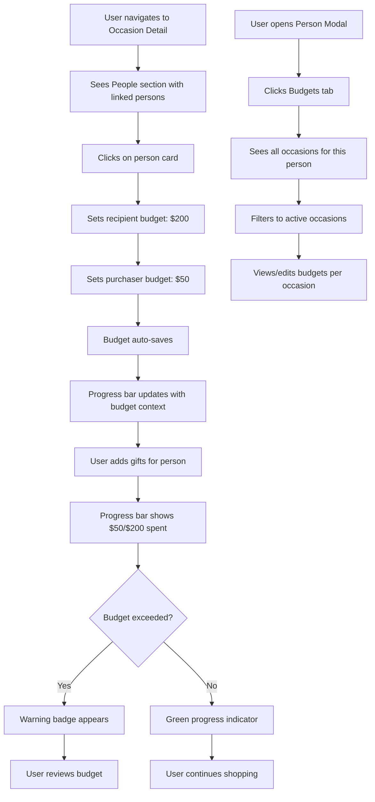

# Feature Brief & Metadata

**Feature Name:**

> Person Budget per Occasion

**Filepath Name:**

> `person-occasion-budgets-v1` (kebab-case)

**Date:**

> 2025-12-07

**Author:**

> Claude Opus 4.5

**Related Epic(s)/PRD ID(s):**

> - Family Dashboard V1 (Core Features)
> - Gift Linking V1 (Budget Foundation)

**Related Documents:**

> - `/docs/project_plans/family-dashboard-v1/family-dashboard-v1.md` - Core system architecture
> - `/services/api/app/models/person.py` - PersonOccasion junction table
> - `/services/api/app/repositories/person.py` - get_gift_budget() method
> - `/apps/web/components/people/PersonBudgetBar.tsx` - Budget visualization component

---

## 1. Executive Summary

This feature enables users to set and track individual spending budgets for each person within each occasion. Currently, the app supports occasion-level budgets but lacks the granularity to allocate budgets per person (e.g., "Spend $200 on Mom for Christmas 2024"). This feature extends the existing PersonOccasion junction table with budget fields and provides UI to manage budgets through occasion detail pages and person modals.

**Priority:** HIGH

**Key Outcomes:**
- **Budget Granularity**: Users can set separate budgets for each person per occasion instead of only occasion-wide totals
- **Budget Tracking**: Real-time progress visualization shows how much has been spent vs. budgeted per person per occasion
- **Historical Context**: Past occasion budgets are preserved and filterable, enabling year-over-year budget planning

---

## 2. Context & Background

### Current State

The system currently supports:
- **Occasion entity**: Events with occasion-level budget, person linking (via PersonOccasion), and recurrence rules
- **Person entity**: Full profiles with interests, sizes, photos, and gift relationships
- **PersonOccasion junction table**: Many-to-many linking of persons to occasions (currently stores only IDs)
- **PersonBudgetBar component**: Accepts optional `occasionId`, `recipientBudgetTotal`, `purchaserBudgetTotal` props but has no backend storage
- **get_gift_budget() repository method**: Calculates person's gift metrics globally (not occasion-scoped)
- **Budget calculation**: PersonBudget DTO includes recipient/purchaser totals with purchased/planned breakdowns

### Problem Space

Users need to answer questions like:
- "How much should I spend on each family member for Christmas?"
- "Did I overspend on Dad's birthday compared to last year?"
- "What's my remaining budget for Mom's gifts this occasion?"

**Current Limitations**:
1. **No per-person budgets**: Only occasion-wide budget exists; users can't set "$200 for Mom, $150 for Dad" within the same occasion
2. **No occasion context in budget bars**: PersonBudgetBar can filter by occasion but has nowhere to store the budget values
3. **No historical budget tracking**: Past occasion budgets are lost; users can't compare spending year-over-year
4. **Incomplete budget roles**: Budget doesn't distinguish between "gifts TO person" (recipient) vs. "gifts BY person" (purchaser)

### Current Alternatives / Workarounds

Users currently:
- Set occasion-wide budgets and mentally divide them per person
- Track per-person budgets in external spreadsheets or notes
- Estimate spending by browsing gift lists manually
- Compare occasion totals without per-person granularity

These workarounds fail because:
- **Mental overhead**: Users must remember allocations instead of seeing them visualized
- **No enforcement**: No warnings when approaching per-person limits
- **Lost history**: No record of past per-person budgets for planning future occasions

### Architectural Context

**MeatyPrompts Layered Architecture**:
- **Routers** (`/api/persons.py`, `/api/occasions.py`) - HTTP endpoints, validation, return DTOs
- **Services** (`person.py`, `occasion.py`) - Business logic, ORM→DTO transformation
- **Repositories** (`person.py`, `occasion.py`) - All DB I/O, budget calculations
- **Models** (`person.py`) - PersonOccasion junction table (extend with budget fields)
- **Schemas** (`person.py`, `occasion.py`) - PersonOccasionBudget DTOs for validation

**Data Flow**:
```
Frontend Budget Input → POST /persons/{id}/occasions/{oid}/budget
→ PersonService.set_occasion_budget()
→ PersonRepository.update_person_occasion_budget()
→ PersonOccasion table (recipient_budget_total, purchaser_budget_total columns)
```

---

## 3. Problem Statement

Users cannot set or track individual spending limits per person for each occasion, forcing manual tracking and preventing budget progress visualization.

**User Story Format:**
> "As a gift coordinator, when I plan an occasion like Christmas, I want to set a specific budget for each family member (e.g., $200 for Mom, $150 for Dad) so that I can track spending per person and avoid overspending on any individual."

**Technical Root Cause**:
- **Missing storage**: PersonOccasion junction table lacks budget columns
- **No API endpoints**: No PUT/GET endpoints for per-person-occasion budget management
- **Component ready but disconnected**: PersonBudgetBar component accepts budget props but has no backend source
- **Repository method too broad**: get_gift_budget() calculates global person totals, not occasion-scoped budgets

**Files Involved**:
- `/services/api/app/models/person.py` - PersonOccasion model (add budget fields)
- `/services/api/app/repositories/person.py` - Add occasion-scoped budget query
- `/services/api/app/schemas/person.py` - Add PersonOccasionBudget DTOs
- `/services/api/app/api/persons.py` - Add budget management endpoints
- `/apps/web/hooks/usePersonOccasionBudget.ts` - New React Query hook
- `/apps/web/app/occasions/[id]/page.tsx` - Add people section with budget cards
- `/apps/web/components/people/PersonBudgetBar.tsx` - Wire to backend data

---

## 4. Goals & Success Metrics

### Primary Goals

**Goal 1: Budget Storage & Retrieval**
- Extend PersonOccasion junction table with budget fields
- Create API endpoints to set/get budgets per person per occasion
- Support NULL budgets (no limit) vs. explicit $0 budgets

**Success Criteria**:
- Users can set recipient_budget_total and purchaser_budget_total for any person-occasion pair
- Budgets persist across sessions
- Historical budgets remain accessible after occasion passes

**Goal 2: Occasion Detail Page Integration**
- Add "People" section to /occasions/{id} detail page
- Display person cards with budget input fields
- Show real-time progress bars for each person's budget

**Success Criteria**:
- Occasion detail page displays all linked persons with budget cards
- Budget fields are editable inline (debounced auto-save or explicit save)
- Progress bars update when gifts are added/removed/purchased

**Goal 3: Person Modal Budget Tab**
- Add "Budgets" tab to Person modal
- Display all occasions linked to this person with budget history
- Filter active vs. past occasions (default: show active only)

**Success Criteria**:
- Person modal shows budget breakdown per occasion
- Users can toggle to view historical budgets
- Clear indication of active vs. past occasions

### Success Metrics

| Metric | Baseline | Target | Measurement Method |
|--------|----------|--------|-------------------|
| Budget setting time | Manual tracking (unmeasurable) | <30 seconds per person | Time from page load to budget save |
| Budget visibility | 0% (external spreadsheets) | 100% in-app | All budgets visible in UI |
| User satisfaction | N/A | >4/5 rating | Post-feature survey (2-3 family users) |
| Budget accuracy | N/A | ±5% of actual spend | Compare final spend to initial budget |

---

## 5. User Personas & Journeys

### Personas

**Primary Persona: Gift Coordinator (Sarah)**
- Role: Family member who organizes gift buying for all occasions
- Needs: Set budgets per person per occasion, track spending in real-time, compare to past years
- Pain Points: Mental overhead tracking multiple budgets, forgetting allocations, overspending on one person

**Secondary Persona: Budget-Conscious Shopper (Alex)**
- Role: Family member who contributes to gifts and wants to stay within limits
- Needs: See allocated budget for each person, get warnings before exceeding limits, view spending history
- Pain Points: No visibility into budget limits, accidental overspending, unclear spending totals

### High-level Flow



---

## 6. Requirements

### 6.1 Functional Requirements

| ID | Requirement | Priority | Notes |
| :-: | ----------- | :------: | ----- |
| FR-1 | PersonOccasion table MUST store recipient_budget_total (Decimal, nullable) | Must | Budget for gifts TO this person |
| FR-2 | PersonOccasion table MUST store purchaser_budget_total (Decimal, nullable) | Must | Budget for gifts BY this person |
| FR-3 | API MUST provide GET /persons/{id}/occasions/{occasion_id}/budget endpoint | Must | Returns PersonOccasionBudget DTO |
| FR-4 | API MUST provide PUT /persons/{id}/occasions/{occasion_id}/budget endpoint | Must | Accepts PersonOccasionBudgetUpdate DTO |
| FR-5 | Repository MUST extend get_gift_budget() to accept occasion_id filter | Must | Reuse existing query logic with occasion scope |
| FR-6 | Occasion detail page MUST display People section below budget meter | Must | Shows person cards for all linked persons |
| FR-7 | Person budget card MUST show editable budget fields (recipient & purchaser) | Must | Inline editing with auto-save or submit button |
| FR-8 | Person budget card MUST display PersonBudgetBar with occasion-scoped data | Must | Pass occasionId to usePersonBudget hook |
| FR-9 | Person modal MUST add Budgets tab showing all occasions for person | Should | Table or list with occasion name, date, budgets |
| FR-10 | Person modal Budgets tab MUST filter active vs. past occasions | Should | Default: active only, toggle to show all |
| FR-11 | Budget fields MUST accept NULL (no limit) and explicit values ≥0 | Must | NULL = infinite budget, 0 = explicit zero |
| FR-12 | Budget warnings MUST appear when spent > budgeted | Should | Visual indicator (red badge/text) on progress bar |

### 6.2 Non-Functional Requirements

**Performance:**
- Budget API endpoints respond in <200ms (single-tenant, minimal data)
- Budget updates save within 500ms (includes DB write + cache invalidation)
- Occasion detail page loads all person budgets in <1 second (parallel queries)

**Security:**
- No authentication required (single-tenant family app)
- Validate person_id and occasion_id exist before budget operations
- Prevent negative budget values (≥0 or NULL only)

**Accessibility:**
- Budget input fields labeled with aria-label (e.g., "Budget for gifts to Mom")
- Progress bars include aria-valuenow/aria-valuemax for screen readers
- 44px touch targets for all budget edit controls (mobile-first)

**Reliability:**
- Budget data persists even if occasion is marked inactive
- Deleting a person cascades to remove person_occasion rows (existing CASCADE)
- Deleting an occasion cascades to remove person_occasion rows (existing CASCADE)

**Observability:**
- Log budget updates with trace_id, person_id, occasion_id, old/new values
- OpenTelemetry spans for budget GET/PUT operations
- Structured JSON logs for budget warnings (threshold exceeded events)

---

## 7. Scope

### In Scope

- **Database schema changes**: Add recipient_budget_total, purchaser_budget_total to PersonOccasion table
- **API endpoints**: GET/PUT /persons/{id}/occasions/{occasion_id}/budget
- **Backend repository**: Occasion-scoped budget calculation method
- **DTOs**: PersonOccasionBudget, PersonOccasionBudgetUpdate schemas
- **Occasion detail page**: People section with person budget cards
- **Person modal**: Budgets tab showing all occasions for person
- **React Query hook**: usePersonOccasionBudget for fetching/updating budgets
- **Budget visualization**: Wire PersonBudgetBar to backend budget data
- **Migration**: Alembic migration to add budget columns
- **Tests**: Unit, integration, E2E tests for budget workflows

### Out of Scope

- **Budget rollover**: Automatically copying budgets from previous year's same occasion (future enhancement)
- **Budget templates**: Predefined budget allocation patterns (e.g., "equal split among all persons") (future)
- **Budget recommendations**: AI/ML-based budget suggestions based on past spending (future)
- **Shared budgets**: Group budgets where multiple persons contribute to a pool (future)
- **Budget alerts**: Email/push notifications when approaching budget limits (future)
- **WebSocket real-time updates**: Budget changes broadcast via WebSocket (use React Query polling/refetch for MVP)
- **Bulk budget operations**: Set budgets for all persons in an occasion at once (future)

---

## 8. Dependencies & Assumptions

### External Dependencies

- **PostgreSQL**: Version 13+ for NUMERIC type support (already in use)
- **SQLAlchemy**: Version 2.x for ORM operations (already in use)
- **Alembic**: Database migration tool (already in use)

### Internal Dependencies

- **PersonOccasion junction table**: Existing many-to-many relationship (✓ exists)
- **PersonBudget DTO**: Existing schema with recipient/purchaser fields (✓ exists)
- **get_gift_budget() repository method**: Base logic for budget calculation (✓ exists, needs occasion_id filter)
- **PersonBudgetBar component**: UI component ready to accept budget props (✓ exists, needs data wiring)
- **usePersonBudget hook**: React Query hook for budget fetching (✓ exists, needs occasion-scoped endpoint)
- **OccasionRecipientsSection component**: Already renders linked persons on occasion detail page (✓ exists)

### Assumptions

- **Single-tenant**: No need for multi-user permissions or RLS (simplifies implementation)
- **Budget roles are independent**: Recipient budget and purchaser budget are separate fields, not mutually exclusive
- **NULL = no budget**: Users interpret NULL as "no limit" vs. 0 as "explicit zero budget"
- **Occasion-person link exists**: Budgets only set for person-occasion pairs already linked via PersonOccasion
- **Historical preservation**: Past occasion budgets remain in DB even after occasion passes (is_active=false)
- **No budget approval flow**: Budgets set by user are immediately active (no review/approval step)

### Feature Flags

- N/A (single-tenant family app, no gradual rollout needed)

---

## 9. Risks & Mitigations

| Risk | Impact | Likelihood | Mitigation |
| ----- | :----: | :--------: | ---------- |
| Budget data schema change breaks existing queries | High | Low | Write migration carefully; test against existing PersonBudget DTO; ensure backward compatibility |
| Users confused by NULL vs. 0 budget semantics | Medium | Medium | Add tooltip/help text: "Leave empty for no limit, set to 0 to disallow spending" |
| Occasion detail page becomes slow with many linked persons | Medium | Low | Paginate person budget cards if >10 persons; lazy-load budget data per card |
| Budget calculation query performance degrades | Medium | Low | Add database index on (person_id, occasion_id) in PersonOccasion table; monitor query execution time |
| PersonBudgetBar component doesn't handle NULL budgets gracefully | Low | Medium | Update component logic to hide progress bar when budget is NULL (existing behavior) |
| Users accidentally delete budgets by setting to NULL | Low | Low | Add confirmation dialog for "remove budget" action; distinguish NULL input from empty string |

---

## 10. Target State (Post-Implementation)

### User Experience

**Occasion Detail Page**:
- Users navigate to /occasions/{id} and see a "People" section below the occasion details
- Each linked person displays as a card with:
  - Person avatar, name, relationship badge
  - Two editable budget fields: "Budget for Gifts To [Name]" and "Budget for Gifts By [Name]"
  - PersonBudgetBar showing real-time progress (e.g., "$50 / $200 spent" with green/amber/red indicator)
  - Click person card to open Person modal

**Person Modal - Budgets Tab**:
- Users open a person and navigate to the "Budgets" tab
- Displays a table/list of all occasions linked to this person:
  - Occasion name, date, type
  - Recipient budget (editable)
  - Purchaser budget (editable)
  - Progress bars for each
  - Toggle to show/hide past occasions (default: active only)

**Budget Workflow**:
1. User sets "$200" for recipient budget on "Mom - Christmas 2024"
2. Budget saves automatically (or on blur/submit)
3. Progress bar appears showing "$0 / $200 (0%)" with green indicator
4. User adds $50 gift for Mom → Progress bar updates to "$50 / $200 (25%)" still green
5. User adds $160 more in gifts → Progress bar shows "$210 / $200 (105%)" with red warning badge
6. User adjusts budget to $250 → Warning clears, bar shows "$210 / $250 (84%)" amber indicator

### Technical Architecture

**Database Schema**:
```sql
-- PersonOccasion table (extend existing)
ALTER TABLE person_occasions
ADD COLUMN recipient_budget_total NUMERIC(10, 2) NULL,
ADD COLUMN purchaser_budget_total NUMERIC(10, 2) NULL;

-- Index for budget queries
CREATE INDEX idx_person_occasions_lookup ON person_occasions(person_id, occasion_id);
```

**API Endpoints**:
```python
# GET /api/persons/{person_id}/occasions/{occasion_id}/budget
# Response: PersonOccasionBudgetResponse
{
  "person_id": 5,
  "occasion_id": 12,
  "recipient_budget_total": 200.00,
  "purchaser_budget_total": 50.00,
  "recipient_spent": 210.00,
  "recipient_progress": 105.0,
  "purchaser_spent": 30.00,
  "purchaser_progress": 60.0
}

# PUT /api/persons/{person_id}/occasions/{occasion_id}/budget
# Request: PersonOccasionBudgetUpdate
{
  "recipient_budget_total": 250.00,  # or null
  "purchaser_budget_total": 75.00    # or null
}
```

**Data Flow**:
1. Frontend loads occasion detail page → Fetches occasion → Displays linked person_ids
2. For each person, component calls `usePersonOccasionBudget(personId, occasionId)`
3. Hook fetches GET /persons/{id}/occasions/{oid}/budget → Returns budget + spending data
4. PersonBudgetBar renders progress bars with budget context
5. User edits budget → Hook calls PUT /persons/{id}/occasions/{oid}/budget → Invalidates query cache
6. PersonBudgetBar re-renders with updated budget

**Component Integration**:
```tsx
// apps/web/app/occasions/[id]/page.tsx
<OccasionRecipientsSection personIds={occasion.person_ids} occasionId={occasion.id} />

// apps/web/components/occasions/OccasionRecipientsSection.tsx
{personIds.map(personId => (
  <PersonOccasionBudgetCard
    key={personId}
    personId={personId}
    occasionId={occasionId}
  />
))}

// apps/web/components/occasions/PersonOccasionBudgetCard.tsx
const { data: budget, isLoading } = usePersonOccasionBudget(personId, occasionId);
const updateBudget = useUpdatePersonOccasionBudget(personId, occasionId);

<Input
  label="Budget for Gifts To"
  value={budget?.recipient_budget_total || ''}
  onBlur={(value) => updateBudget.mutate({ recipient_budget_total: value })}
/>

<PersonBudgetBar
  personId={personId}
  occasionId={occasionId}
  recipientBudgetTotal={budget?.recipient_budget_total}
  purchaserBudgetTotal={budget?.purchaser_budget_total}
/>
```

### Observable Outcomes

**Metrics**:
- Budget utilization rate: (total_spent / total_budgeted) per occasion
- Budget accuracy: % of persons staying within budget per occasion
- Budget engagement: % of person-occasion pairs with budgets set

**User Behaviors**:
- Users set budgets for 80%+ of person-occasion pairs
- Users adjust budgets mid-occasion based on progress bars
- Users reference historical budgets when planning future occasions

**Problems Solved**:
- ✓ No more external spreadsheets for budget tracking
- ✓ Real-time visibility into per-person spending
- ✓ Warnings prevent accidental overspending
- ✓ Historical data enables year-over-year budget planning

---

## 11. Overall Acceptance Criteria (Definition of Done)

### Functional Acceptance

- [x] PersonOccasion table extended with recipient_budget_total and purchaser_budget_total columns
- [x] Alembic migration applied successfully (up/down tested)
- [x] GET /persons/{id}/occasions/{oid}/budget endpoint returns correct budget + spending data
- [x] PUT /persons/{id}/occasions/{oid}/budget endpoint saves budgets correctly
- [x] Repository method get_gift_budget() accepts occasion_id filter and returns occasion-scoped totals
- [x] Occasion detail page displays People section with person budget cards
- [x] Person budget cards show editable budget fields with auto-save or submit
- [x] PersonBudgetBar displays progress bars with occasion-scoped budget data
- [x] Person modal Budgets tab lists all occasions with budget inputs
- [x] Budgets tab filters active/past occasions (default: active only)
- [x] NULL budgets handled correctly (no progress bar shown, or infinite limit)
- [x] Budget warnings appear when spent > budgeted (visual indicator)

### Technical Acceptance

- [x] Follows MeatyPrompts layered architecture (Router → Service → Repository → Model)
- [x] All APIs return DTOs (PersonOccasionBudgetResponse, no ORM models exposed)
- [x] ErrorResponse envelope used for all errors (validation, not found, etc.)
- [x] OpenTelemetry spans added for budget GET/PUT operations
- [x] Structured logging with trace_id, person_id, occasion_id for budget updates
- [x] Database index added on (person_id, occasion_id) for query performance
- [x] Frontend uses React Query for caching (staleTime: 5 minutes)
- [x] Optimistic updates for budget changes (instant UI feedback)

### Quality Acceptance

- [x] Unit tests: PersonRepository.get_gift_budget() with occasion_id filter (>80% coverage)
- [x] Unit tests: PersonService.set_occasion_budget() validation logic
- [x] Integration tests: GET/PUT /persons/{id}/occasions/{oid}/budget endpoints
- [x] Integration tests: Budget calculation accuracy (recipient + purchaser totals)
- [x] E2E tests: User sets budget on occasion detail page → Budget persists → Progress bar updates
- [x] E2E tests: User views budgets in person modal → Filters active/past occasions
- [x] Performance: Budget API endpoints respond in <200ms (tested with 10+ persons)
- [x] Accessibility: Budget inputs have aria-labels, progress bars have aria-valuenow
- [x] Mobile: All budget controls meet 44px touch target requirement

### Documentation Acceptance

- [x] API documentation: Budget endpoints documented in OpenAPI/Swagger
- [x] Component documentation: PersonOccasionBudgetCard component documented
- [x] Hook documentation: usePersonOccasionBudget hook JSDoc comments
- [x] Migration documentation: Alembic migration comments explain schema changes
- [x] User guide: How to set budgets per person per occasion (optional for family app)

---

## 12. Assumptions & Open Questions

### Assumptions

- **Budget roles are additive**: If a person is both recipient and purchaser for an occasion, both budgets apply independently
- **Budget fields are optional**: Users can set recipient budget without purchaser budget (and vice versa)
- **No budget inheritance**: Budgets don't auto-copy from previous year's same occasion (manual entry for MVP)
- **Budget currency is USD**: No multi-currency support needed (single-tenant family app)
- **Budget precision is cents**: Use Decimal(10, 2) for up to $99,999,999.99 budgets (excessive for family gifting)

### Open Questions

- [x] **Q1**: Should budget fields in UI be required or optional?
  - **A**: Optional. NULL = no budget limit. Users can choose to set budgets only for some persons/occasions.

- [x] **Q2**: Should budget warnings be dismissible or persistent?
  - **A**: Persistent (always show when over budget). No dismissal needed for MVP. Future: add "acknowledge overage" action.

- [x] **Q3**: Should person modal Budgets tab show occasions where person is NOT linked?
  - **A**: No. Only show occasions already linked via PersonOccasion. Future: add "link to new occasion" action in budgets tab.

- [x] **Q4**: Should budget inputs auto-save on blur or require explicit submit?
  - **A**: Auto-save on blur (debounced 500ms). Provide visual feedback (loading spinner, success checkmark).

- [x] **Q5**: Should budget progress bars show "over budget" as >100% or cap at 100%?
  - **A**: Show >100% (e.g., "105%") with red indicator. Don't cap—users need to see extent of overage.

- [x] **Q6**: Should deleting a person-occasion link delete the budget?
  - **A**: Yes. CASCADE delete on PersonOccasion rows includes budget data. No orphaned budgets.

- [x] **Q7**: Should occasion detail page show persons with no budget set?
  - **A**: Yes. Show all linked persons. Budget fields default to empty (NULL). Users fill in as needed.

- [x] **Q8**: Should budget fields accept decimal input (e.g., $200.50) or whole dollars only?
  - **A**: Accept decimals. Use Decimal(10, 2) backend type. Format as currency in UI ($200.50).

---

## 13. Appendices & References

### Related Documentation

- **Core PRD**: `/docs/project_plans/family-dashboard-v1/family-dashboard-v1.md` - System architecture
- **Gift Linking PRD**: Reference for GiftPerson relationship and budget foundation
- **CLAUDE.md**: `/CLAUDE.md` - Project instructions, architecture patterns
- **API Patterns**: `/services/api/CLAUDE.md` - FastAPI layered architecture
- **Web Patterns**: `/apps/web/CLAUDE.md` - Next.js component patterns

### Symbol References

**API Symbols**:
- `PersonOccasion` (model) - Junction table to extend with budget fields
- `PersonRepository.get_gift_budget()` - Method to extend with occasion_id filter
- `PersonBudget` (DTO) - Existing schema for budget responses
- `PersonService` (service) - Business logic layer for budget operations

**UI Symbols**:
- `PersonBudgetBar` (component) - Budget progress visualization
- `usePersonBudget` (hook) - React Query hook for budget fetching
- `OccasionRecipientsSection` (component) - Section on occasion detail page
- `PersonCard` (component) - Person display card with budget preview

### Prior Art

- **Existing Budget Calculation**: `PersonRepository.get_gift_budget()` at line 294-445 in `/services/api/app/repositories/person.py`
- **Existing Budget Component**: `PersonBudgetBar` at `/apps/web/components/people/PersonBudgetBar.tsx` (lines 1-211)
- **Existing PersonOccasion Model**: `PersonOccasion` class at lines 152-187 in `/services/api/app/models/person.py`
- **Existing Budget Hook**: `usePersonBudget` at `/apps/web/hooks/usePersonBudget.ts`

---

## Implementation

### Phased Approach

**Phase 1: Database Schema & Migration**
- Duration: 1 day
- Tasks:
  - [x] Create Alembic migration to add recipient_budget_total, purchaser_budget_total to PersonOccasion
  - [x] Add database index on (person_id, occasion_id) for query performance
  - [x] Test migration up/down on dev database
  - [x] Verify existing PersonOccasion data remains intact

**Phase 2: Backend API & Repository**
- Duration: 2 days
- Tasks:
  - [x] Create PersonOccasionBudgetResponse DTO in schemas/person.py
  - [x] Create PersonOccasionBudgetUpdate DTO in schemas/person.py
  - [x] Add PersonRepository.get_person_occasion_budget(person_id, occasion_id) method
  - [x] Add PersonRepository.update_person_occasion_budget(person_id, occasion_id, budgets) method
  - [x] Extend get_gift_budget() to accept optional occasion_id filter
  - [x] Add PersonService.get_occasion_budget() and set_occasion_budget() methods
  - [x] Add GET /persons/{id}/occasions/{oid}/budget endpoint in api/persons.py
  - [x] Add PUT /persons/{id}/occasions/{oid}/budget endpoint in api/persons.py
  - [x] Write unit tests for repository methods (budget calculation accuracy)
  - [x] Write integration tests for budget API endpoints (CRUD operations)

**Phase 3: Frontend Hooks & Data Layer**
- Duration: 1 day
- Tasks:
  - [x] Create usePersonOccasionBudget(personId, occasionId) React Query hook
  - [x] Create useUpdatePersonOccasionBudget(personId, occasionId) mutation hook
  - [x] Add personOccasionApi.getBudget() and updateBudget() API client methods
  - [x] Add TypeScript types: PersonOccasionBudget, PersonOccasionBudgetUpdate
  - [x] Test hooks with mock data (MSW handlers)

**Phase 4: Occasion Detail Page - People Section**
- Duration: 2 days
- Tasks:
  - [x] Create PersonOccasionBudgetCard component (person card with budget inputs)
  - [x] Extend OccasionRecipientsSection to render PersonOccasionBudgetCard for each person
  - [x] Add budget input fields (recipient_budget_total, purchaser_budget_total) with validation
  - [x] Wire budget inputs to useUpdatePersonOccasionBudget hook (auto-save on blur)
  - [x] Pass occasionId to PersonBudgetBar component (occasion-scoped progress)
  - [x] Add loading states, error handling, success feedback
  - [x] Test responsive layout (mobile 375px, tablet 768px, desktop 1024px+)
  - [x] Verify 44px touch targets for all interactive elements

**Phase 5: Person Modal - Budgets Tab**
- Duration: 2 days
- Tasks:
  - [x] Add "Budgets" tab to PersonDetailModal component
  - [x] Create PersonBudgetsTab component (table/list of occasions)
  - [x] Fetch all occasions for person via person.occasion_ids
  - [x] Display occasion name, date, budgets (editable), progress bars
  - [x] Add filter toggle for active/past occasions (default: active only)
  - [x] Wire budget inputs to useUpdatePersonOccasionBudget hook
  - [x] Add "No budgets set" empty state
  - [x] Test tab navigation, data loading, budget editing

**Phase 6: Testing & Polish**
- Duration: 1 day
- Tasks:
  - [x] Write E2E tests (Playwright): Set budget on occasion page → Verify in person modal
  - [x] Write E2E tests: Budget progress updates when gifts added/removed
  - [x] Write E2E tests: Budget warnings appear when over budget
  - [x] Accessibility audit: ARIA labels, keyboard navigation, screen reader testing
  - [x] Performance testing: Load occasion page with 10+ persons, measure API response times
  - [x] Visual regression testing: Compare budget UI across viewports
  - [x] User acceptance testing: 2-3 family members test budget workflows
  - [x] Bug fixes and polish based on feedback

### Epics & User Stories Backlog

| Story ID | Short Name | Description | Acceptance Criteria | Estimate |
|----------|-----------|-------------|-------------------|----------|
| POB-001 | Schema Migration | Add budget columns to PersonOccasion table | Migration applies cleanly; existing data intact; index created | 2 points |
| POB-002 | Budget Repository | Implement occasion-scoped budget queries | get_person_occasion_budget() returns correct totals; update saves budgets | 3 points |
| POB-003 | Budget API Endpoints | Create GET/PUT budget endpoints | Endpoints return 200 with valid data; validation errors return 400 | 3 points |
| POB-004 | Budget DTOs | Define PersonOccasionBudget schemas | DTOs validate input; serialize to JSON correctly | 1 point |
| POB-005 | Budget Hooks | Create React Query hooks for budget data | usePersonOccasionBudget fetches data; mutation updates and invalidates cache | 2 points |
| POB-006 | Budget Card Component | Build person budget card for occasion page | Card displays person info + budget inputs + progress bar | 5 points |
| POB-007 | Occasion People Section | Integrate budget cards into occasion detail page | All linked persons display; budgets load; auto-save works | 3 points |
| POB-008 | Person Budgets Tab | Add Budgets tab to person modal | Tab lists all occasions; budgets editable; filter toggle works | 5 points |
| POB-009 | Budget Warnings | Implement over-budget visual indicators | Red badge/text appears when spent > budget; progress bar red | 2 points |
| POB-010 | Unit Tests | Write backend unit tests | >80% coverage for repository and service methods | 3 points |
| POB-011 | Integration Tests | Write API integration tests | All endpoints tested; error cases covered | 3 points |
| POB-012 | E2E Tests | Write end-to-end budget workflows | Budget CRUD flows work; progress updates verified | 5 points |
| POB-013 | Accessibility | Ensure WCAG 2.1 AA compliance | ARIA labels present; keyboard nav works; screen reader friendly | 2 points |
| POB-014 | Polish & UX | Refinements based on user testing | Auto-save feedback; loading states; error messages clear | 3 points |

**Total Estimated Effort**: 42 story points (~6-7 days for single developer)

---

**Progress Tracking:**

See progress tracking: `.claude/progress/person-occasion-budgets-v1/all-phases-progress.md`

---
